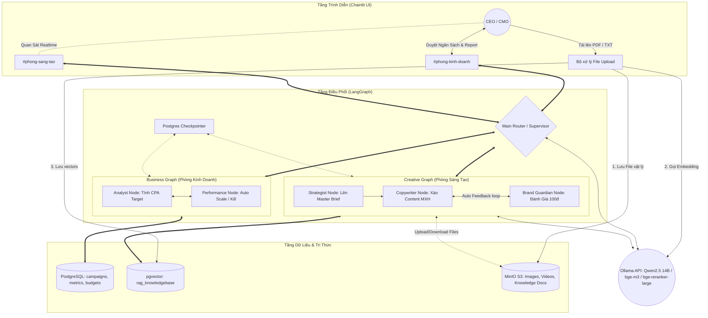

# KẾ HOẠCH TRIỂN KHAI: MARKETING AGENT OS v2.0 (IMPLEMENTATION PLAN)

Tài liệu này trình bày chi tiết phương án kỹ thuật và kế hoạch phát triển hệ thống **Marketing Agent OS v2.0** dựa trên các tài liệu thiết kế nghiệp vụ, kế thừa dữ liệu từ hệ thống TMCP cũ và các quyết định đã thống nhất.

---

## 1. TỔNG QUAN HỆ THỐNG (SYSTEM ARCHITECTURE)

Hệ thống được thiết kế theo kiến trúc **N-Tier**, chia làm 3 phân hệ chính:
1. **Presentation Layer (Chainlit UI):** Cung cấp không gian làm việc đa kênh (`#phong-kinh-doanh`, `#phong-sang-tao`), streaming thời gian thực, hiển thị trạng thái của Agent và hỗ trợ cơ chế tạm dừng duyệt bài (Human-in-the-loop). **Đặc biệt, tích hợp cổng upload tài liệu trực tiếp từ UI chat để tự động trích xuất và vector hóa vào kho tri thức.**
2. **Orchestration Layer (LangGraph):** Lõi điều phối đa tác tử (Multi-Agent). Gồm một `Main Router` (Supervisor) điều phối giữa 2 đồ thị con độc lập: `Business Graph` (Phòng Kinh Doanh) và `Creative Graph` (Phòng Sáng Tạo).
3. **Data & Memory Layer (PostgreSQL + pgvector + MinIO):** 
    *   **PostgreSQL + pgvector:** Lưu trữ dữ liệu quan hệ, dữ liệu tracking JSONB và bộ nhớ ngữ nghĩa (Semantic RAG) sử dụng vector embedding 1024-chiều (model `bge-m3` của Ollama).
    *   **MinIO Object Storage:** Hệ thống lưu trữ đối tượng (Object Storage) tương thích chuẩn S3, dùng để lưu trữ toàn bộ các tệp vật lý (ảnh, video kịch bản quảng cáo và tài liệu tri thức PDF/TXT do người dùng tải lên).



---

## 2. THIẾT KẾ CƠ SỞ DỮ LIỆU & BỘ NHỚ LƯU TRỮ

### 2.1. Kích hoạt Extension pgvector & Bảng Tri Thức (RAG Tables)
Vector dimension được cấu hình là `1024` tương thích hoàn toàn với model `bge-m3` của Ollama.
```sql
CREATE EXTENSION IF NOT EXISTS vector;

CREATE TABLE rag_knowledgebase (
    id UUID PRIMARY KEY DEFAULT gen_random_uuid(),
    workspace_id UUID REFERENCES workspaces(id) ON DELETE CASCADE,
    category VARCHAR(50) NOT NULL, -- 'economics', 'psychology', 'anti_patterns', 'user_upload'
    source_name VARCHAR(255),      -- Tên file tài liệu gốc (VD: 'Content_Guidelines.pdf')
    content TEXT NOT NULL,
    metadata JSONB,
    embedding VECTOR(1024),
    created_at TIMESTAMP WITH TIME ZONE DEFAULT CURRENT_TIMESTAMP
);

-- HNSW Index hỗ trợ Semantic Search siêu tốc
CREATE INDEX ON rag_knowledgebase USING hnsw (embedding vector_cosine_ops);
```

### 2.2. Cấu hình MinIO Object Storage
MinIO được thiết lập qua `docker-compose.yml` để cung cấp môi trường S3 local. 
*   **Bucket mặc định:** `marketing-assets`
*   **PostgreSQL Mapping:** Bảng `media_assets` và các tệp tin RAG tải lên sẽ được lưu trữ với `file_key` (ví dụ: `workspaces/ws1/knowledge/Choosing_Objective.pdf`) và URL để tải/xem lại nếu cần.

---

## 3. QUY TRÌNH VECTOR HÓA FILE TỰ ĐỘNG TỪ UI (INTERACTIVE VECTORIZATION FLOW)

Khi Sếp thực hiện kéo thả hoặc tải lên tài liệu (PDF, TXT, DOCX) trực tiếp tại giao diện chat của Chainlit:

```
[Sếp tải file lên Chainlit] 
       │
       ▼
[1. Chainlit nhận file. Gửi file vật lý lên MinIO bucket 'marketing-assets']
       │
       ▼
[2. Trích xuất văn bản (Text Extraction)]
   ├── Nếu là file .txt: Đọc nội dung UTF-8 trực tiếp.
   └── Nếu là file .pdf: Sử dụng thư viện 'pypdf' để trích xuất text từng trang.
       │
       ▼
[3. Cắt nhỏ văn bản (Text Chunking)]
   - Chia nhỏ văn bản thành các đoạn (chunks) khoảng 500 ký tự.
   - Độ gối đầu (overlap) giữa các đoạn là 50 ký tự để không mất ngữ cảnh ở biên.
       │
       ▼
[4. Gọi Ollama API tạo Embeddings]
   - Gọi model 'bge-m3' để biến đổi từng chunk văn bản thành vector 1024-chiều.
       │
       ▼
[5. Lưu trữ vào PostgreSQL]
   - Ghi các đoạn văn bản kèm vector embedding, metadata (tên file, số trang) vào bảng 'rag_knowledgebase' với category = 'user_upload'.
       │
       ▼
[6. Thông báo kết quả realtime trên UI]
   - "Đã học và vector hóa thành công tài liệu 'Choose_Platforms.pdf' thành 42 phân đoạn tri thức!"
```

---

## 4. THIẾT KẾ ĐỒ THỊ ĐA TÁC TỬ (LANGGRAPH & OLLAMA SYSTEM)

### 4.1. Trạng Thái Toàn Cục (`AgencyState`)
```python
from typing import TypedDict, List, Annotated, Dict, Any
from langchain_core.messages import BaseMessage
import operator

class AgencyState(TypedDict):
    messages: Annotated[List[BaseMessage], operator.add]
    current_channel: str                 # '#phong-kinh-doanh' hoặc '#phong-sang-tao'
    workspace_id: str
    campaign_id: str
    product_id: str
    target_cpa: float
    global_budget: float
    current_angle: Dict[str, Any]
    master_content: Dict[str, Any]
    variants: List[Dict[str, Any]]
    feedback_log: List[str]
```

### 4.2. Quy trình RAG và Reranker (Tích hợp bge-reranker-large)
Để nâng cao độ chính xác của tri thức được tiêm vào prompt:
1.  **Retrieval:** Strategist/Copywriter tìm kiếm Vector trên `rag_knowledgebase` (bao gồm cả tri thức do hệ thống nạp sẵn và tài liệu do Sếp tải lên `category IN ('economics', 'psychology', 'user_upload')`) sử dụng cosine similarity (`K=10`).
2.  **Reranking:** Gửi danh sách 10 tài liệu tìm được kèm theo truy vấn gốc sang model `bge-reranker-large:latest` chạy trên Ollama.
3.  **Filtering:** Lọc lấy **Top-3** tài liệu có điểm tương quan cao nhất để tiêm vào prompt của LLM, khống chế số lượng token luôn dưới `1000 tokens`.

---

## 5. GIAO DIỆN & LUỒNG HUMAN-IN-THE-LOOP (CHAINLIT PRESENTATION)

### 5.1. Workspace Đa Kênh (Channel-Based UI)
Sử dụng thanh Sidebar và cơ chế Chat Profiles hoặc Tags của Chainlit để chia không gian:
*   Kênh **`#phong-kinh-doanh`**: Chỉ hiển thị các báo cáo tài chính, CPA Target, quyết định Scale/Kill Ads của Performance Agent, và các nút Approve ngân sách.
*   Kênh **`#phong-sang-tao`**: Nơi các Agent Strategist, Copywriter và Brand Guardian "thảo luận" (Stream các suy luận nội bộ). CEO có thể vào đọc để quan sát quy trình.

### 5.2. Nhận diện File tải lên
Trong sự kiện `cl.on_message`:
```python
@cl.on_message
async def on_message(message: cl.Message):
    # Kiểm tra xem có file đính kèm không
    if message.elements:
        for element in message.elements:
            if element.type == "file" and element.mime in ["application/pdf", "text/plain"]:
                # Kích hoạt quy trình vector hóa bất đồng bộ
                await process_and_vectorize_file(element)
```

---

## 6. DANH MỤC FILE & THƯ MỤC CẦN KHỞI TẠO (PROPOSED PROJECT STRUCTURE)

```
marketing-agent-os/
│
├── docker-compose.yml              # PostgreSQL (pgvector), MinIO Object Storage
├── requirements.txt                # Thư viện Python (LangGraph, Chainlit, SQLAlchemy, pgvector, boto3, pypdf)
│
├── db/
│   ├── __init__.py
│   ├── connection.py               # Kết nối PostgreSQL sử dụng SQLAlchemy
│   ├── schema.sql                  # File DDL khởi tạo toàn bộ CSDL v2.0
│   └── seed.py                     # Script nạp dữ liệu mẫu từ marketing_schema.json cũ
│
├── core/
│   ├── __init__.py
│   ├── models.py                   # Pydantic & SQLAlchemy Models
│   ├── ollama_client.py            # Wrap gọi Ollama (Qwen2.5 14B, bge-m3, bge-reranker-large)
│   ├── storage.py                  # MinIO Client kết nối qua thư viện boto3
│   ├── parser.py                   # [NEW] Trích xuất text từ PDF/TXT và cắt nhỏ (Chunking)
│   └── rag.py                      # Logic tìm kiếm Vector kết hợp Rerank và nạp tri thức
│
├── graphs/
│   ├── __init__.py
│   ├── state.py                    # Định nghĩa State (AgencyState, Sub-states)
│   ├── business.py                 # Định nghĩa Business Graph (Analyst & Performance Nodes)
│   ├── creative.py                 # Định nghĩa Creative Graph (Strategist, Copywriter, Guardian Nodes)
│   └── main_router.py              # Đồ thị tổng điều phối (Supervisor)
│
├── app.py                          # Giao diện Chainlit UI chính thức (Multi-channel & File uploads)
│
└── tests/
    ├── __init__.py
    ├── test_database.py            # Test kết nối và ràng buộc ngân sách
    ├── test_storage.py             # Test upload/download tệp tin với MinIO
    ├── test_parser.py              # [NEW] Test trích xuất PDF và sinh chunks
    ├── test_scoring.py             # Test logic chấm điểm Guardian Agent
    └── test_workflow.py            # Test luồng chạy thử nghiệm A/B tự trị
```

---

## 7. KẾ HOẠCH XÁC MINH & KIỂM THỬ (VERIFICATION PLAN)

### 7.1. Kiểm Thử Tự Động (Automated Tests)
Chúng ta sẽ viết bộ test suite trong thư mục `tests/` để xác minh các tính năng cốt lõi trước khi deploy:
1.  **`test_database.py`:** Kiểm tra Postgres Check Constraints và tìm kiếm vector cosine.
2.  **`test_storage.py`:** Upload tệp tin thử nghiệm lên MinIO và tải xuống kiểm tra tính toàn vẹn của tệp.
3.  **`test_parser.py`:** Thử nghiệm trích xuất một file PDF nhỏ trong thư mục `docs/docsmarketing/` $\rightarrow$ Kỳ vọng sinh ra các chunks text sạch sẽ.
4.  **`test_scoring.py`:** Chạy thử logic của Brand Guardian Node $\rightarrow$ Kỳ vọng chấm điểm chính xác theo barem 100đ.
5.  **`test_workflow.py`:** Mô phỏng luồng hội thoại từ lúc lên Brief $\rightarrow$ Viết kịch bản $\rightarrow$ Chấm điểm $\rightarrow$ Interrupt $\rightarrow$ Resume.

### 7.2. Kiểm Thử Thủ Công (Manual Verification)
1.  **Kiểm tra tính năng Vector hóa từ UI:** Khởi động Chainlit, kéo thả file `Choose+Your+Objective.pdf` vào khung chat $\rightarrow$ Chờ hệ thống báo hoàn thành $\rightarrow$ Thực hiện đặt câu hỏi để kiểm tra RAG có lấy thông tin từ tài liệu vừa tải lên không.
2.  **Kiểm tra Giao diện Đa Kênh:** Chạy `chainlit run app.py`, mở trình duyệt kiểm tra việc chuyển kênh `#phong-kinh-doanh` và `#phong-sang-tao`.
3.  **Kiểm tra Human-in-the-loop:** Chạy thử kịch bản sáng tạo nội dung, đợi Guardian chấm điểm và kiểm tra nút Approve/Reject.

---

## 8. CÁC QUYẾT ĐỊNH ĐÃ THỐNG NHẤT (AGREED DECISIONS)

1.  **Seeding CSDL mẫu:** Tự động đồng bộ hóa, đọc file `marketing_schema.json` cũ để sinh file migration PostgreSQL (`schema.sql`) và dữ liệu test khởi tạo (`seed.py`).
2.  **Tích hợp Reranker:** Sử dụng model `bge-reranker-large:latest` ngay trong phiên bản v2.0 đầu tiên để tối ưu hóa tri thức RAG cho Strategist Node.
3.  **Lưu trữ Files vật lý:** Sử dụng **MinIO Object Storage** (S3-compatible) tự host trong Docker Compose. File vật lý được tải lên MinIO và PostgreSQL chỉ lưu khóa đối tượng (`file_key`) cùng đường dẫn truy cập (`file_url`).
4.  **Học tài liệu trực quan từ UI (Interactive Upload):** Người dùng có thể kéo thả trực tiếp tệp PDF/TXT vào khung chat của Chainlit. Hệ thống sẽ tự động lưu vào MinIO, phân rã văn bản thành các chunk 500 ký tự, gọi Ollama tạo vector embedding `bge-m3` và chèn vào pgvector của PostgreSQL để làm giàu kho tri thức RAG ngay tức thì.
