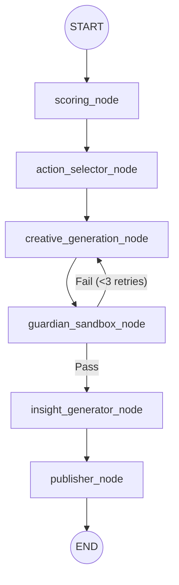

# 02_GRAPH_STATE_SCHEMA.md

Tài liệu đặc tả Graph State sử dụng trong LangGraph (Stateless Mode).

## 1. Dữ liệu State (AgencyState)

> [!IMPORTANT]
> `AgencyState` kế thừa từ `TypedDict`. State này là **Stateless**, không được persist qua SQLite/PostgreSQL bởi LangGraph checkpointer. Dữ liệu đầu vào (Context) do FastAPI Orchestrator tiêm vào tại runtime.

```python
from typing import TypedDict, List, Dict, Any, Optional

class AgencyState(TypedDict):
    # Context injected by Python Backend Orchestrator
    workspace_id: str
    campaign_id: str
    product_id: str
    campaign_objective: str       # 'BRAND_AWARENESS' or 'LEAD_GEN'
    current_metrics: Dict[str, Any]   # Historical performance metrics of latest batch
    current_beliefs: Dict[str, Any]   # MAB calculated beliefs/priors per creative angle
    baseline_copy: Optional[str]      # The text of the best performing variant to iterate upon
    
    # Internal generation state variables
    sop_stage: str                # Current stage in the automated SOP
    selected_actions: List[Dict[str, Any]]    # Mix of Exploit / Explore creative directions
    generated_variants: List[Dict[str, Any]]  # Generated copies packaged for downstream
    sandbox_feedbacks: List[Dict[str, Any]]   # Brand safety failures and feedback

    # Autopilot Cockpit observability fields (injected by bandit_orchestrator)
    _run_id: Optional[str]        # UUID of the active PipelineRun record (None if tracker unavailable)
    _execution_mode: Optional[str]  # 'shadow' | 'live' — controls whether publisher calls real APIs
```

## 2. Graph Node Workflow

Luồng thực thi chính (Main Router):



### Chức năng từng Node:

- `scoring_node`: Lấy metrics từ DB và tính toán/cập nhật Beliefs (Multi-Armed Bandit).
- `action_selector_node`: Chọn ra các hướng sáng tạo (Angles) kết hợp giữa Exploit (phát huy cái tốt) và Explore (thử nghiệm cái mới).
- `creative_generation_node`: Gọi LLM (Ollama) viết nội dung quảng cáo dựa trên các hướng đã chọn và `baseline_copy`.
- `guardian_sandbox_node`: LLM chấm điểm an toàn thương hiệu (Brand Safety). Nếu lỗi -> push vào `sandbox_feedbacks` và route về `creative_generation`.
- `insight_generator_node`: Đúc kết bài học (Insights) từ đợt chạy này, chuẩn bị lưu DB.
- `publisher_node`: Đẩy nội dung đã duyệt lên nền tảng thật (nếu `_execution_mode` = live) hoặc log lại (shadow mode).
