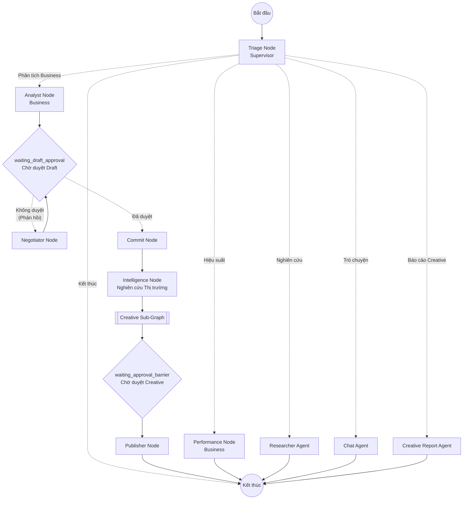
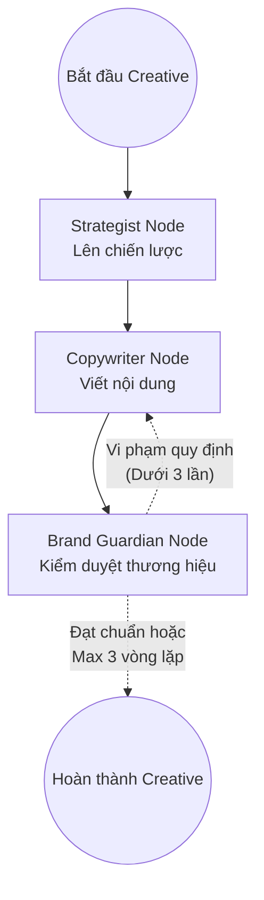

# Sơ đồ Kiến trúc Graphs (Agent Workflows)

Tài liệu này mô tả kiến trúc tổng quát của hệ thống Multi-Agent được tổ chức trong thư mục `graphs`. Hệ thống sử dụng thư viện LangGraph để quản lý trạng thái, tạo luồng công việc (workflow) và điều hướng giữa các agent (các node).

## 1. Sơ đồ Tổng quát (Main Graph)

Luồng chính (Main Router) nhận yêu cầu đầu vào từ người dùng hoặc API, sau đó đi qua bước Triage (Supervisor) để phân loại và điều hướng đến các luồng công việc tương ứng. 

Hệ thống có khả năng tạm dừng tại các "chốt chặn" (Barriers) để chờ con người (Human-in-the-loop) kiểm duyệt trước khi tiếp tục.

## 2. Sơ đồ Creative Sub-Graph

Khi luồng công việc chính đi vào giai đoạn sáng tạo (Creative), hệ thống sẽ gọi một đồ thị con (sub-graph). Đây là nơi các AI Agent đóng vai trò chuyên gia sáng tạo phối hợp làm việc với nhau, có bao gồm vòng lặp phản hồi (feedback loop) để tự động sửa lỗi.

## 3. Chi tiết Thành phần và Chức năng

### 3.1. Supervisor (`graphs/supervisor/`)
- **Triage Node**: Điểm tiếp nhận và phân luồng trung tâm. Đọc ngữ cảnh của người dùng và quyết định sẽ gọi đến Agent nào để xử lý.
- **Chat Node**: Chuyên xử lý các hội thoại trò chuyện thông thường.
- **State**: Định nghĩa các cấu trúc dữ liệu toàn cục (như `AgencyState`) cho toàn bộ graph.

### 3.2. Business (`graphs/business/`)
- **Analyst Node**: Xử lý các yêu cầu chuyên sâu về mảng kinh doanh, tạo bản nháp (draft).
- **Negotiator Node**: Agent tham gia vào việc đàm phán, tranh luận hoặc chỉnh sửa lại bản nháp nếu người dùng/sếp chưa đồng ý với bản nháp hiện tại.
- **Commit Node**: Đánh dấu trạng thái bản nháp đã được chốt/duyệt để chuẩn bị cho giai đoạn thực thi.
- **Performance Node**: Đọc, tổng hợp và báo cáo về hiệu suất (performance).

### 3.3. Creative (`graphs/creative/`)
- **Creative Subgraph**: Đóng gói quy trình tạo nội dung. Bao gồm 3 vai trò:
  - **Strategist Node**: Tạo chiến lược định hướng.
  - **Copywriter Node**: Viết bài, tạo kịch bản dựa trên định hướng.
  - **Brand Guardian Node**: Kiểm tra chéo bài viết xem có chuẩn văn phong, quy định thương hiệu hay không. Nếu không, trả lại yêu cầu Copywriter sửa.
- **Publisher Node**: Thực hiện các thao tác đăng tải/xuất bản nội dung ra ngoài hoặc lưu trữ sau khi đã hoàn chỉnh.
- **Creative Reporter Node**: Tạo các báo cáo chuyên sâu liên quan đến khía cạnh sáng tạo.

### 3.4. Research (`graphs/research/`)
- **Researcher Node**: Agent chuyên gia về tìm kiếm thông tin và tổng hợp kiến thức từ các nguồn đa dạng.

### 3.5. Intelligence (Tích hợp trong luồng chính)
- **Intelligence Node**: Cung cấp dữ liệu nghiên cứu thị trường (ví dụ: tìm kiếm video, bình luận của đối thủ từ YouTube qua SerpApi), nhằm làm giàu ngữ cảnh cho đội ngũ Creative trước khi họ bắt tay vào sáng tạo.

### 3.6. Cơ chế "Human-in-the-Loop" (Chốt chặn)
Đây là các node dừng (interrupt) để người dùng can thiệp:
- `waiting_draft_approval`: Tạm dừng quá trình lập kế hoạch kinh doanh để đợi người dùng xem và quyết định: Duyệt (đi tiếp đến Commit) hay Yêu cầu sửa lại (chuyển sang Negotiator).
- `waiting_approval_barrier`: Tạm dừng sau khi nhóm Creative làm xong nội dung. Nếu người dùng duyệt, nội dung mới đi đến bước Publish.