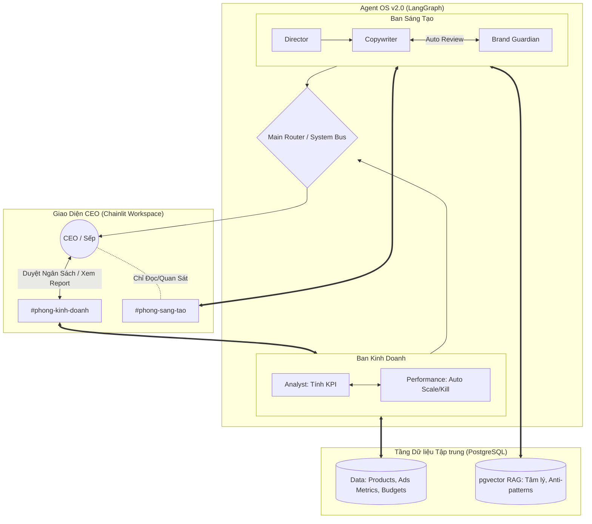

# BẢN THIẾT KẾ KIẾN TRÚC: MARKETING AGENT OS v2.0

**Định hướng:** Chuyển đổi từ hệ thống tự động hóa cứng nhắc sang một **Hệ Điều Hành Tác Tử (Agent OS)** linh hoạt cấp doanh nghiệp.
**Triết lý cốt lõi:** Trợ lý chuyên môn (LangGraph) tự chủ thực thi ở tầng Vi mô (Micro). Sếp (CEO/CMO) giám sát qua Giao diện Đa Kênh (Chainlit) và quản trị ở tầng Vĩ mô (Macro - Chiến lược & Ngân sách).

---

## 6 TINH TÚY KIẾN TRÚC (GÓC NHÌN CMO & CTO)

### 1. Nguyên lý "Human-in-the-Loop Vĩ Mô" (Sếp không làm thợ duyệt bài)
Sếp (CMO/CEO) không phải là người đi check lỗi chính tả hay duyệt từng kịch bản TikTok. Đó là việc của Brand Guardian Agent. Quản trị của con người nằm ở tầng cao nhất:
- **Duyệt Ngân sách & Định hướng:** Hệ thống chỉ "Tag" sếp để xin phép khi bắt đầu một Campaign mới (Xin cấp quỹ test A/B) hoặc khi cần thay đổi chiến lược lớn.
- **Quan sát Đa Kênh (Department Channels):** Giao diện Chainlit chia thành `#phong-kinh-doanh`, `#phong-sang-tao`. Sếp có thể vào "đọc lén" để biết AI đang vận hành đúng quỹ đạo không, nhưng **không can thiệp** vào tiểu tiết chuyên môn nếu số liệu vẫn đang tốt.

### 2. Nguyên lý "Phân quyền Chuyên môn" (Separation of Concerns)
Tách biệt thành các Sub-graphs để LLM không bị tẩu hỏa nhập ma:
- **Phòng Phân Tích (Business Graph):** Gồm Analyst Agent & Performance Agent. Tính Target CPA, theo dõi số liệu, và **tự động ra quyết định Kill/Scale** các chiến dịch dựa trên luật do Sếp đặt ra.
- **Phòng Sáng Tạo (Creative Graph):** Gồm Strategist, Copywriter, Guardian. Tự động nhận đề bài từ Phòng Phân Tích, tự viết, tự cãi nhau, tự sửa bài và tự xuất bản bản nháp.

### 3. Nguyên lý "Dữ liệu Quyết định Hành động" (Data-Driven KPI)
Không đẻ ý tưởng suông bằng cảm tính.
- Toàn bộ dữ liệu (Sản phẩm, Margin, Lịch sử Ads, Target KPI) lưu tại **PostgreSQL**.
- Mọi chiến dịch bắt đầu từ Phòng Kinh Doanh: Gọi Database tính ra `CPA Tối đa`. Phòng sáng tạo bị ép buộc bám vào con số này để làm mồi nhử truyền thông (Hook).

### 4. Nguyên lý "Ký ức Phân tầng & RAG Chuyên Môn" (Tri-Layer Memory)
LLM không đọc Raw Data để tránh tràn bộ nhớ:
- **Ký ức Ngắn hạn:** Code gom nhóm dữ liệu PostgreSQL thành báo cáo 7 ngày (VD: "CPA tuần này tăng 20%") để AI đưa ra action.
- **RAG Chuyên Môn (pgvector):** Sử dụng PostgreSQL để lưu `RAG_KinhTe` (cho Analyst), `RAG_TamLyHoc` (cho Strategist), và `RAG_AntiPatterns` (lưu tự động các kịch bản bị Performance Agent đánh trượt để rút kinh nghiệm).

### 5. Nguyên lý "Thử nghiệm Sinh tồn Tự Trị" (Autonomous A/B Testing) - *[Góc nhìn CMO]*
Marketing là trò chơi xác suất, không ai đoán trước được mẫu nào sẽ Win.
- Sếp chỉ cấp **"Ngân sách Test"** (Ví dụ: 2 triệu VNĐ cho chiến dịch X).
- Phòng Sáng tạo tự động đẻ ra tối thiểu 3 Variants (3 Angles khác nhau).
- Hệ thống tự động push lên chạy Ads. Sau 24-48h, **Performance Agent tự động đọc Data PostgreSQL**:
  - Tự động TẮT (Kill) các mẫu vượt quá CPA Target.
  - Tự động VÍT (Scale) ngân sách cho mẫu Win.
  - Sau đó mới xuất Báo cáo tổng kết gửi lên kênh `#phong-kinh-doanh` cho Sếp xem kết quả. (Sếp quản lý bằng kết quả, không quản lý quy trình test).

### 6. Nguyên lý "Minh bạch & Truy vết" (Observability & Auditability) - *[Góc nhìn CTO]*
Mọi quyết định tự động của AI phải giải thích được (Explainable AI).
- Nếu Performance Agent tự tắt một chiến dịch, nó phải để lại log: *"Tự động Kill Variant B vì [Trích dẫn ID dòng Data PostgreSQL: CPA đạt 200k, vượt ngưỡng 150k trong 2 ngày]"*.
- Sếp có thể trace (truy vết) lại mọi suy nghĩ của AI bất cứ lúc nào nếu thấy có dấu hiệu đốt tiền sai lệch.

---

## TECH STACK CHÍNH THỨC

1. **Giao diện (UI/UX):** `Chainlit` (Mô phỏng Workspace dạng Channels).
2. **Orchestration:** `LangGraph` (Quản lý State và Thread ID cho từng kênh).
3. **Database:** `PostgreSQL` (Lưu data quan hệ + JSONB + Vector RAG qua `pgvector`).
4. **Bộ não (LLM):** `Qwen2.5 14B` (Chạy local qua Ollama).

---

## SƠ ĐỒ KIẾN TRÚC MỚI (PHÂN QUYỀN TỰ TRỊ)

