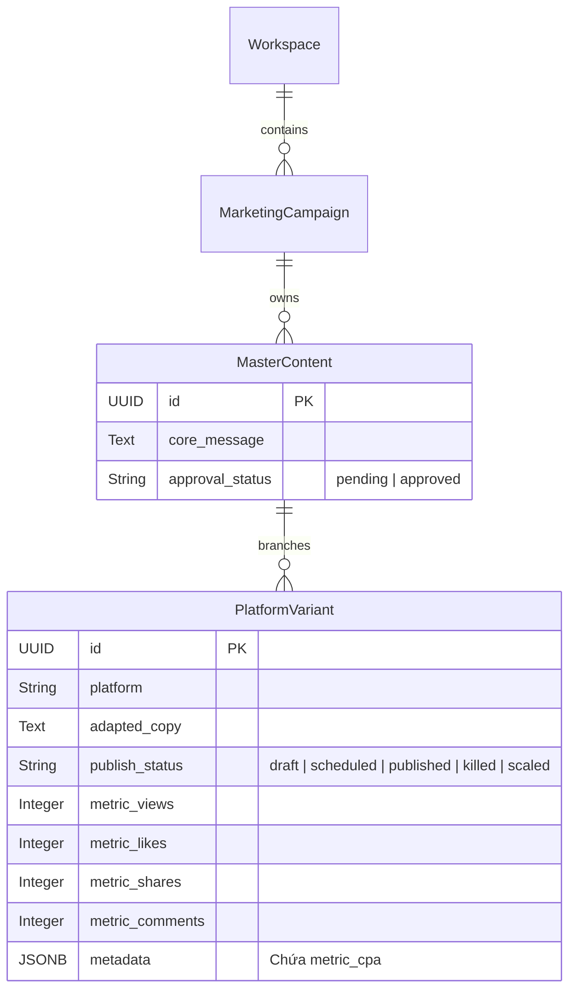

# THIẾT KẾ CHI TIẾT: PHÂN HỆ BÁO CÁO TỰ TRỊ (REPORTING AGENT SYSTEM v3.0)
*Chịu trách nhiệm thiết kế: Lead Architect & AI Director*

Phân hệ báo cáo trong **Marketing Agent OS v3.0** đã được nâng cấp toàn diện nhằm giải quyết triệt để hai thách thức lớn nhất của phiên bản cũ: **Sự cố nghẽn luồng trạng thái (State-Loop Deadlock)** khi Sếp đổi ý và **Sự thô sơ của các thông điệp cảnh báo** vốn không đủ chiều sâu phân tích số liệu để giúp CMO ra quyết định vĩ mô.

---

## 1. ĐẶT VẤN ĐỀ & MỤC TIÊU THIẾT KẾ

### Thách thức v2.1:
1. **Trạng thái kẹt (State-Loop):** Sau khi `performance_node` thực hiện tối ưu hóa, `sop_stage` bị bỏ ngỏ hoặc giữ nguyên ở các trạng thái cũ khiến Triage Router (Supervisor) liên tục định tuyến vòng lặp về cùng một phòng ban, không thể "bẻ lái" sang hội thoại thông thường hoặc chủ đề khác khi Sếp yêu cầu.
2. **Báo cáo nghèo nàn:** Các phòng ban chỉ đưa ra tin nhắn thô, ví dụ: *"Đã tắt variant_id do CPA vượt ngưỡng"* hoặc *"Mọi thứ an toàn"*. CMO không nắm được bức tranh tổng thể: Lượt xem, tương tác, A/B testing hiệu quả ra sao.

### Giải pháp v3.0:
1. **Thiết kế Tác tử Báo cáo Độc lập (Independent Reporting Agents):** Xây dựng hai tác tử chuyên sâu: **Creative Reporter Agent** (cho phòng Sáng Tạo) và **Performance Reporter Agent** (cho phòng Kinh Doanh/Performance).
2. **Tổng hợp Dữ liệu Lớn bằng LLM (LLM-Synthesized Analytics):** Kết nối trực tiếp xuống CSDL PostgreSQL, truy vấn toàn bộ các thực thể liên kết (`MasterContent`, `PlatformVariant`), tính toán các chỉ số views, likes, shares, comments, CPA thực tế, CPA Target và đẩy toàn bộ ngữ cảnh thô vào Ollama Qwen2.5 để tự động biên soạn báo cáo dạng bảng biểu Markdown đỉnh cao.
3. **Cơ chế Reset SOP tự động:** Mọi node báo cáo sau khi in kết quả ra UI bắt buộc phải reset trạng thái `sop_stage = "triage"` để Triage Router giải phóng luồng, sẵn sàng cho các lệnh tiếp theo từ Sếp.

---

## 2. KIẾN TRÚC MÔ HÌNH DỮ LIỆU THỰC TẾ (DATABASE BINDING)

Cả hai tác tử báo cáo đều truy cập trực tiếp vào CSDL thông qua SQLAlchemy Session (`SessionLocal`) để đảm bảo tính thời gian thực (real-time) của số liệu.



### Cách thức trích xuất dữ liệu:
- **Creative Reporter:** Truy vấn toàn bộ `MasterContent` và `PlatformVariant` liên kết để tính tổng số Angle đã xây dựng, số kịch bản được duyệt, và trạng thái phân phối trên các kênh.
- **Performance Reporter:** Truy vấn tất cả `PlatformVariant` đang ở trạng thái `published` (hoặc đã tối ưu), tính tổng tương tác (`views`, `likes`, `shares`, `comments`) và đọc chỉ số `metric_cpa` từ cột `metadata` của JSONB để so sánh trực tiếp với `target_cpa` được tính từ điểm neo kinh tế vĩ mô của sản phẩm.

---

## 3. THIẾT KẾ PROMPT LLM CHUYÊN SÂU (PREMIUM PROMPT SYSTEM)

### A. Creative Reporter Agent Prompt
Prompt được tinh chỉnh để LLM đóng vai trò là một **Creative Director/Tech Lead** am hiểu sâu sắc về văn phong và độ tuân thủ thương hiệu:

```text
Bạn là Trợ lý Báo cáo Sáng tạo (Creative Reporter Agent) của CMO.
Dưới đây là các số liệu hoạt động thực tế của ban Sáng Tạo được truy xuất từ CSDL hệ thống:

SỐ LIỆU BAN SÁNG TẠO:
- Tổng số góc tiếp cận chiến lược (Angles) đã xây dựng: {total_angles}
- Tổng kịch bản được Sếp duyệt đăng (Scheduled): {scheduled_copies}
- Tổng kịch bản đang chạy thực tế (Published): {published_copies}
- Tổng kịch bản bị khai tử do CPA vượt ngưỡng (Killed): {killed_copies}
- Tổng kịch bản được tăng ngân sách hiệu quả (Scaled): {scaled_copies}

CHI TIẾT CÁC GÓC TIẾP CẬN VÀ KỊCH BẢN ĐÃ TẠO:
{creative_details_str}

YÊU CẦU TRẢ LỜI:
1. Tổng hợp một bản báo cáo bằng Tiếng Việt chuyên nghiệp, cấu trúc Markdown rõ ràng, gãy gọn, có bảng biểu đẹp mắt.
2. Đánh giá chất lượng sáng tạo: Các Angle đề xuất (Fear, Gain, v.v.), sự gãy gọn của thông điệp cốt lõi và khả năng chuyển đổi.
3. Chỉ rõ các điểm sáng của copywriter (kịch bản được duyệt) và các bài học cần rút kinh nghiệm (kịch bản bị tắt/killed due to CPA).
4. Trả lời với giọng văn của một Tech Lead/Creative Director am hiểu sâu sắc về số liệu và hành vi người dùng, đánh giá khách quan.
```

### B. Performance Reporter Agent Prompt
Prompt được tinh chỉnh để LLM đóng vai trò là một **Performance Marketing Director** cực kỳ thực tế, sắc bén, tập trung vào tối ưu hóa chi phí và ROI:

```text
Bạn là Trợ lý Báo cáo Hiệu suất (Performance Reporter Agent) của ban Kinh Doanh.
Dưới đây là các số liệu hiệu suất chiến dịch thực tế được truy xuất từ CSDL hệ thống:

TỔNG THỂ HIỆU SUẤT CHIẾN DỊCH:
- Tổng số kịch bản quảng cáo được đánh giá: {total_variants}
- Số kịch bản đã tắt (KILLED - do CPA vượt ngưỡng): {killed_count}
- Số kịch bản được tăng ngân sách (SCALED - hoạt động hiệu quả): {scaled_count}
- Số kịch bản đang chạy (PUBLISHED): {published_count}
- Tổng lượt xem (Views): {total_views:,}
- Tổng lượt thích (Likes): {total_likes:,}
- Tổng lượt chia sẻ (Shares): {total_shares:,}
- Tổng lượt bình luận (Comments): {total_comments:,}
- CPA Target (Ngưỡng tối đa cho phép): {target_cpa:,.0f} VNĐ

CHI TIẾT TỪNG KỊCH BẢN QUẢNG CÁO:
{details_str}

YÊU CẦU TRẢ LỜI:
1. Tổng hợp một bản báo cáo hiệu suất bằng Tiếng Việt chuyên nghiệp gửi cho CMO.
2. Bắt buộc có bảng biểu Markdown hiển thị so sánh hiệu suất giữa các kịch bản quảng cáo. Bảng gồm các cột: Kênh, Lượt xem, Lượt thích, CPA thực tế, CPA Target, Trạng thái tối ưu, Tóm tắt nội dung.
3. Phân tích cụ thể lý do tại sao một số kịch bản bị khai tử (KILLED) và tại sao một số kịch bản được tăng ngân sách (SCALED). Nhận xét mối quan hệ giữa lượt xem, tương tác và CPA.
4. Đề xuất các khuyến nghị hành động cụ thể tiếp theo cho CMO để tối ưu hóa hiệu quả kinh doanh của toàn chiến dịch.
5. Giữ giọng văn cực kỳ chuyên nghiệp, sắc bén của một Performance Marketing Director, phân tích dựa trên dữ liệu cụ thể, không nói chung chung.
```

---

## 4. TÍCH HỢP HỆ THỐNG & ĐỒNG BỘ LANGGRAPH STATE MACHINE

### Khai báo và Đăng ký Node trong `graphs/main_router.py`:
Tác tử Báo cáo Sáng tạo được tích hợp trực tiếp vào StateGraph của LangGraph như một nút kết thúc (Terminal Node) độc lập:

```python
# Đăng ký node
builder.add_node("creative_report_agent", creative_report_node)

# Cấu hình định tuyến từ Supervisor triage
builder.add_conditional_edges(
    "triage",
    route_after_triage,
    {
        "analyst": "analyst",
        "performance": "performance",
        "researcher_agent": "researcher_agent",
        "chat_agent": "chat_agent",
        "creative_report_agent": "creative_report_agent",
        "end": END
    }
)

# Thiết lập điểm kết thúc luồng tự động
builder.add_edge("creative_report_agent", END)
```

---

## 5. STREAMING KẾT QUẢ ĐA KÊNH TRÊN CHAINLIT UI

Tại `app.py`, luồng streaming bất tuần tự (`astream`) lắng nghe sự kiện hoàn thành của từng nút chuyên môn. Giao thức tương tác được thiết lập như sau:

```python
elif node_name == "performance":
    # Hiển thị báo cáo hiệu suất cao cấp từ LLM nếu có sẵn trong state messages
    new_msgs = node_update.get("messages", [])
    if new_msgs:
        report = new_msgs[-1].content
        await cl.Message(content=report).send()
    else:
        # Fallback hiển thị scale/kill cơ bản
        ...

elif node_name == "creative_report_agent":
    new_msgs = node_update.get("messages", [])
    if new_msgs:
        report = new_msgs[-1].content
        await cl.Message(content=report).send()
```

### Lợi ích vượt trội:
- **Giao diện Hài hòa:** Dù Sếp chat ở bất kỳ phòng ban nào, thông tin vẫn được định tuyến thông minh và phản hồi với định dạng Markdown sang trọng nhất, có biểu đồ dạng bảng Markdown rõ nét.
- **Không bao giờ đứt gãy luồng:** Trạng thái `sop_stage` được reset ngay lập tức về `"triage"`. Khi Sếp muốn đổi ý từ xem báo cáo hiệu suất kinh doanh sang viết một chiến dịch mới, Triage Hub v3.0 sẽ nhanh chóng nhận diện và rẽ nhánh sang `analyst` ngay lập tức mà không gặp bất kỳ xung đột nào.
