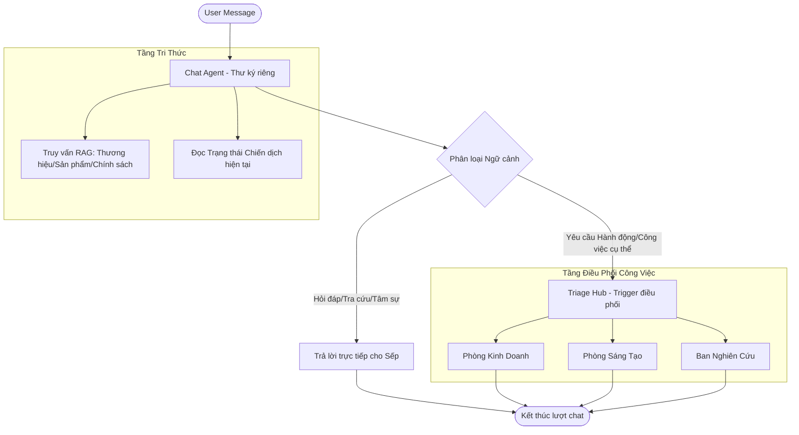

# INTELLIGENT SUPERVISOR HUB (v4.0) — Kiến Trúc "Thư Ký Riêng" (Knowledge-First)

**Thay thế:** Kiến trúc Triage-First (v3.0) — Khô khan và mù tri thức.
**Áp dụng từ:** Sprint 4 — Hệ Điều Hành Marketing Tỉnh Táo.
**Chịu trách nhiệm:** Chief Architect & CTO (Dựa trên chỉ đạo trực tiếp của CMO).

---

## 1. Triết Lý Thiết Kế (The "Assistant-First" Philosophy)

Trong kinh doanh, tri thức là sức mạnh. Một hệ điều hành AI không được phép điều hướng người dùng đi lòng vòng khi chính nó đang nắm giữ câu trả lời trong tay.

*   **Sai lầm của v3.0:** Đưa con "Lính gác cổng" (Triage) ra trước. Thằng này chỉ biết luật, không biết dữ liệu, dẫn đến việc sếp hỏi về thương hiệu mà nó lại dẫn đi tính tiền quảng cáo (Analyst).
*   **Kiến trúc v4.0:** Đưa con **"Thư ký riêng" (Chat Agent)** đứng trước. Con này được trang bị toàn bộ tri thức doanh nghiệp (RAG + Brand DNA). Nhiệm vụ của nó là **Hứng và Thấu hiểu** trước khi **Điều hướng**.

---

## 2. Sơ Đồ Luồng Kiến Trúc Mới

---

## 3. Các Lớp Xử Lý Chi Tiết (Pipeline 4.0)

### Lớp 1: Hứng Dữ Liệu & Nạp DNA (Knowledge Injection)
Thay vì chỉ nạp lịch sử chat, Chat Agent ngay khi nhận tin nhắn phải được tiêm (Inject) toàn bộ thông tin tĩnh và động của doanh nghiệp từ Database.
- **DNA:** Brand Name, Slogan, USP, Voice & Tone.
- **Context:** Chiến dịch nào đang chạy, kịch bản nào vừa bị chửi (Anti-patterns).

### Lớp 2: Xử Lý Hỏi Đáp (Inquiry Handling)
Nếu tin nhắn của sếp là câu hỏi (Inquiry), Chat Agent **BẮT BUỘC** phải trả lời ngay dựa trên tri thức hiện có. Tuyệt đối không đẩy sang các phòng ban chuyên môn nếu chưa có lệnh làm việc.

### Lớp 3: Kích Hoạt Trigger (Action Detection)
Chỉ khi phát hiện các động từ mạnh hoặc yêu cầu quy trình (ví dụ: *"Lên bài đi", "Sửa kịch bản", "Chạy ads"*) $\rightarrow$ Chat Agent mới đóng vai trò là "Trigger" gọi con Triage ra để bắt đầu luồng LangGraph.

### Lớp 4: Điều Hướng Chính Xác (Precision Routing)
Con Triage (vốn khô khan) lúc này chỉ tập trung vào việc:
- Phân chia Task cho Analyst (Tính CPA).
- Giao việc cho Creative (Viết Copy).
- Nhờ Researcher (Cào data đối thủ).

---

## 4. Thay Đổi Kỹ Thuật (Cho Team Dev)

| Thành phần | Thay đổi so với v3.0 |
|---|---|
| **Entry Point** | Đổi từ `triage_node` sang `chat_agent_node`. |
| **Logic Router** | `chat_agent` sẽ trả về một `router_signal`. Nếu signal là `workflow` -> chuyển sang `triage`. |
| **System Prompt** | Chat Agent được dạy: "Bạn là Thư ký riêng, nắm giữ DNA của VNB Sports. Hãy trả lời sếp trước, chỉ làm việc khi sếp ra lệnh". |
| **RAG Usage** | Chat Agent sử dụng `retrieve_chunks_reranked` ngay từ bước 1. |

---

## 5. Quy Tắc Bảo Vệ Dữ Liệu (Dành cho CMO)

Để tránh "sai lệch bối cảnh" như sếp đã chửi:
1.  **Cấm Fallback Tĩnh:** Tuyệt đối không dùng dữ liệu "G-Agent Tech" làm mẫu. Nếu không có dữ liệu thật trong DB, Agent phải báo cáo: *"Dạ em chưa thấy thông tin [X] trong hệ thống, sếp nạp thêm cho em nhé"*.
2.  **Validation Thật:** Mọi con số CPA, Ngân sách phải query realtime từ PostgresSQL, không được tự bịa ra con số 1.050.000đ khi sếp chưa thiết lập.

---

**Nhiệm vụ cho Team Dev:** Ngừng ngay luồng Triage-first. Tái cấu trúc lại `main_router.py` theo sơ đồ Knowledge-first ở trên. Đảm bảo tri thức doanh nghiệp phải dẫn dắt hành động, chứ không phải quy trình bóp chết tri thức.
