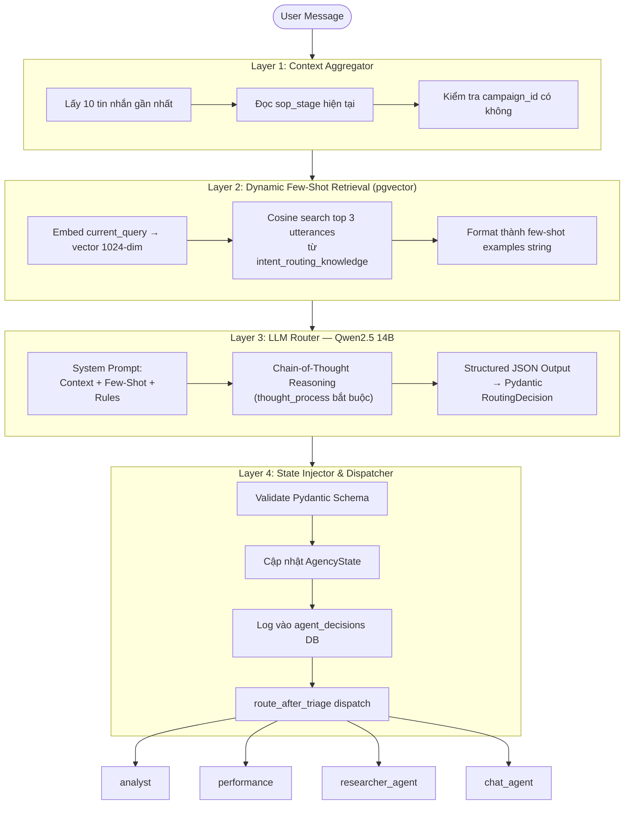

# INTELLIGENT SUPERVISOR HUB — Thiết Kế 4-Layer Triage Architecture (v3.0)

**Thay thế:** Vector-Only Semantic Router (v2.1)
**Áp dụng từ:** Sprint 3 — Triage Upgrade
**Chịu trách nhiệm:** Chief Architect

---

## 1. Tổng Quan & Lý Do Nâng Cấp

### Vấn đề của Vector-Only Router (v2.1)

```
messages[-1] → embed → cosine distance → if distance < 0.30 → intent
```

| Hạn chế | Ví dụ cụ thể |
|---|---|
| Mất ngữ cảnh hội thoại | User đang tạo chiến dịch dở, nhắn "sửa ngân sách 5 triệu" → router phân loại sai thành `chat` |
| Không phát hiện follow-up | Câu nối tiếp bị xử lý như yêu cầu mới hoàn toàn |
| Vector quyết định trực tiếp | pgvector chỉ đo khoảng cách, không hiểu ngữ nghĩa ngữ cảnh |
| Không trích xuất entities | Các node phía sau phải tự parse lại từ câu nói người dùng |

### Giải pháp: 4-Layer Intelligent Supervisor Hub

pgvector chuyển vai trò từ "bộ não ra quyết định" → "bộ nhớ cung cấp gợi ý cho LLM". LLM mới là bộ não thực sự với khả năng Chain-of-Thought reasoning.

---

## 2. Sơ Đồ Luồng 4-Layer



---

## 3. Pydantic Schema — RoutingDecision

File: [`graphs/routing_models.py`](file:///wsl.localhost/server/root/marketing-agent-os/graphs/routing_models.py)

```python
class RoutingDecision(BaseModel):
    thought_process: str      # Chain-of-Thought bắt buộc — chống hallucination
    is_follow_up: bool        # True nếu câu này tiếp nối chủ đề trước
    intent: Literal[
        "chat",
        "show_metrics",
        "create_campaign",
        "research"
    ]
    extracted_entities: Dict[str, Any]  # Entities sẵn cho node phía sau
```

### Ý nghĩa từng field:

| Field | Mục đích | Ví dụ |
|---|---|---|
| `thought_process` | Buộc LLM suy luận trước khi quyết định, tránh ảo giác | `"User đang ở sop_stage='creative_generation', câu 'sửa ngân sách' → rõ ràng là follow-up của create_campaign"` |
| `is_follow_up` | Flag context-awareness — giúp analyst/strategist biết có nên kế thừa context không | `true` |
| `intent` | Intent cuối cùng | `"create_campaign"` |
| `extracted_entities` | Entities bóc tách sẵn — node phía sau không cần re-parse | `{"budget": 5000000, "product_name": "G-Agent Tech"}` |

---

## 4. System Prompt Reference

```
## Quy tắc suy luận (trích):
1. Nếu sop_stage KHÔNG phải "triage" hoặc "chat" VÀ user nhắn ngắn gọn bổ sung
   → is_follow_up=true, giữ nguyên intent của luồng đó.
2. Ưu tiên ngữ cảnh hội thoại gần nhất khi câu nói mơ hồ.
3. Trích xuất entities nếu có.
4. PHẢI viết thought_process step-by-step TRƯỚC khi kết luận intent.
```

---

## 5. Config Settings

File: [`config/settings.py`](file:///wsl.localhost/server/root/marketing-agent-os/config/settings.py)

```python
TRIAGE_CONTEXT_MESSAGES = 10    # Số tin nhắn Layer 1 thu thập
TRIAGE_FEW_SHOT_COUNT = 3       # Số utterances Layer 2 trả về
TRIAGE_FALLBACK_INTENT = "research"  # Fallback an toàn khi LLM lỗi
```

---

## 6. Routing Table

File: [`graphs/triage.py`](file:///wsl.localhost/server/root/marketing-agent-os/graphs/triage.py) — `route_after_triage()`

| Intent | Node tiếp theo | Kênh Chainlit |
|---|---|---|
| `create_campaign` | `analyst` | `#phong-kinh-doanh` |
| `show_metrics` | `performance` | `#phong-kinh-doanh` |
| `research` | `researcher_agent` | `#phong-sang-tao` |
| `chat` | `chat_agent` | `#phong-sang-tao` |

---

## 7. So Sánh Trước / Sau

| Tiêu chí | v2.1 (Vector-Only) | v3.0 (Intelligent Supervisor Hub) |
|---|---|---|
| **Đầu vào** | `messages[-1]` (1 câu) | 10 tin nhắn gần nhất + `sop_stage` + `campaign_id` |
| **Cơ chế quyết định** | cosine distance < 0.30 → intent | LLM Chain-of-Thought + few-shot guidance |
| **Vai trò pgvector** | Bộ não ra quyết định | Bộ nhớ gợi ý few-shot cho LLM |
| **Context-awareness** | ❌ Không | ✅ `is_follow_up` + conversation history |
| **Entity extraction** | ❌ Không | ✅ `extracted_entities` |
| **Observability** | Log basic | ✅ `thought_process` lưu vào DB |
| **Follow-up handling** | ❌ Phân loại sai | ✅ Phát hiện và giữ nguyên luồng |
| **Mở rộng intent** | Thêm utterances + threshold tuning | Thêm 1 dòng vào system prompt |
| **Latency** | ~0.5s (vector only) | ~3-5s (LLM inference) |
| **Accuracy (edge cases)** | Thấp với câu mơ hồ | Cao — LLM hiểu ngữ cảnh |

---

## 8. Chat Agent (Mới thêm — v3.0)

File: [`graphs/chat.py`](file:///wsl.localhost/server/root/marketing-agent-os/graphs/chat.py)

Node mới `chat_agent` xử lý intent `chat` thay vì để hệ thống im lặng (behavior cũ: `chat → END`).

**Tính năng:**
- Trả lời hội thoại thông thường thân thiện.
- Hướng dẫn người dùng các tính năng hệ thống khi được hỏi.
- Fallback message an toàn khi LLM lỗi.

---

## 9. AgencyState Extensions

File: [`graphs/state.py`](file:///wsl.localhost/server/root/marketing-agent-os/graphs/state.py)

3 field mới được thêm vào `AgencyState`:

```python
is_follow_up: bool                   # Context-aware routing flag
extracted_entities: Dict[str, Any]   # Entities từ Triage (budget, product_name...)
routing_thought_process: str         # CoT suy luận để truy vết & audit
```

---

## 10. Kế Hoạch Mở Rộng Tương Lai

Khi cần thêm tính năng mới (ví dụ: `project_management`):

1. ✅ Thêm node `project_management_node` trong `graphs/`
2. ✅ Thêm 1 dòng vào system prompt: `"- 'project_management': Quản lý WBS, phân công..."`
3. ✅ Thêm 1 entry vào `routing_table` trong `route_after_triage()`
4. ✅ Thêm utterances mẫu vào `db/seed.py`
5. ✅ Kết nối node trong `main_router.py`

**Không cần thay đổi logic 4-Layer pipeline.**
