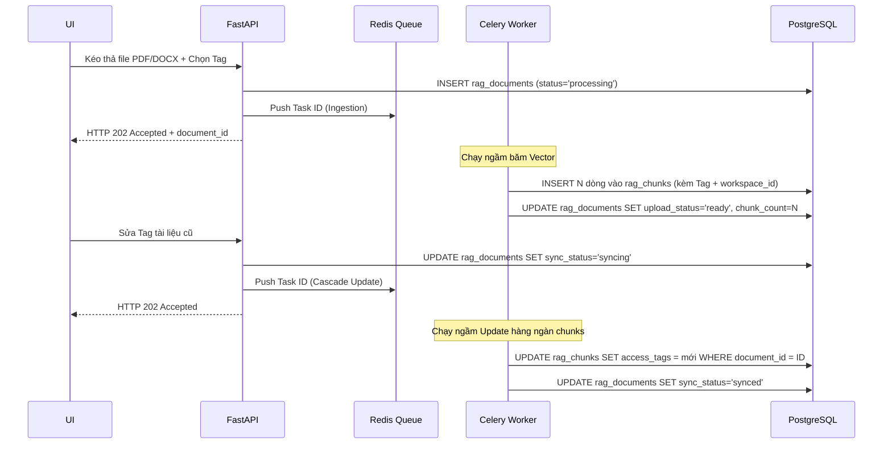

# 📚 TÀI LIỆU THIẾT KẾ: HỆ THỐNG QUẢN TRỊ TRI THỨC TẬP TRUNG (ENTERPRISE RAG)

**Mã tài liệu:** SYS-DES-RAG-001  
**Chịu trách nhiệm thiết kế:** Chief Technology Officer (CTO)  
**Dành cho:** Backend Developer, Frontend Developer, AI Engineer  
**Trạng thái:** ✅ Chốt phương án triển khai v3 (Cập nhật 30/05/2026 — Bổ sung workspace_id, Master Tags, Migration Strategy, Sync Status)

---

## 1. TỔNG QUAN KIẾN TRÚC (THE POOL - TAGS - KEYS MODEL)

Hệ thống nâng cấp kiến trúc RAG lên mô hình Ma trận Phân quyền & Siêu dữ liệu (Metadata Access Control Matrix), bao gồm 3 lớp nhằm chia sẻ tài liệu linh hoạt giữa các Agent mà vẫn đảm bảo cách ly dữ liệu:

1. **Lớp Lưu trữ (The Pool):** Một CSDL Vector duy nhất chứa toàn bộ tri thức doanh nghiệp.
2. **Lớp Siêu dữ liệu (The Tags):** Các tài liệu được gắn nhãn phòng ban (JSONB), quản lý bởi bảng Master Tags.
3. **Lớp Tác tử (The Keys):** Các Agent được cấp quyền thông qua cơ chế Pre-Retrieval Filtering trực tiếp (Zero-JOIN) để giữ nguyên tốc độ của Index HNSW.

### 1.1. Chiến lược Migration (Từ `rag_knowledgebase` cũ)

> **Quyết định:** Thay thế hoàn toàn bảng `rag_knowledgebase` cũ. Không giữ backward-compatible.

Quy trình:
1. Backup toàn bộ dữ liệu bảng `rag_knowledgebase` cũ ra file SQL/CSV
2. Tạo bảng mới `rag_documents` + `rag_chunks` + `rag_access_tags`
3. Chạy script migration: import dữ liệu cũ vào bảng mới (map `category` → `access_tags`, tạo parent document cho mỗi `source_name`)
4. Cập nhật toàn bộ code trỏ sang bảng mới
5. DROP bảng `rag_knowledgebase` sau khi verify thành công

---

## 2. THIẾT KẾ CƠ SỞ DỮ LIỆU (DATABASE SCHEMA)

**Triết lý thiết kế (Cập nhật quan trọng):**  
Áp dụng **Phi chuẩn hóa (Denormalization)**. Cố tình đưa dư thừa các trường `access_tags` và `is_deleted` từ bảng Cha xuống bảng Con. Trong hệ thống RAG, thao tác Đọc (Query) chiếm 99%. Việc loại bỏ phép JOIN giúp PostgreSQL Query Planner tận dụng tối đa Index HNSW, giảm độ trễ từ giây xuống mili-giây.

### 2.0. Bảng Quản lý Tags (Master: `rag_access_tags`) — MỚI v3

Bảng master data quản lý danh sách tag hợp lệ, ngăn insert tag sai chính tả, hỗ trợ UI hiển thị dropdown chọn tag.

```sql
CREATE TABLE rag_access_tags (
    tag_id UUID PRIMARY KEY DEFAULT gen_random_uuid(),
    workspace_id UUID NOT NULL REFERENCES workspaces(id) ON DELETE CASCADE,
    tag_name VARCHAR(100) NOT NULL,
    description VARCHAR(500),
    color VARCHAR(7) DEFAULT '#6366f1',       -- Mã màu hex hiển thị trên UI
    created_at TIMESTAMP WITH TIME ZONE DEFAULT CURRENT_TIMESTAMP,
    
    UNIQUE(workspace_id, tag_name)            -- Không cho phép tag trùng tên trong cùng workspace
);

-- Seed tag mặc định cho mỗi workspace mới
-- INSERT INTO rag_access_tags (workspace_id, tag_name, description, color) VALUES
-- (ws_id, 'global', 'Tài liệu công khai cho tất cả Agent', '#22c55e');
```

### 2.1. Bảng Quản lý Tài liệu (Parent: `rag_documents`)
Quản lý trạng thái và siêu dữ liệu của file gốc (Dùng cho giao diện quản trị UI).

```sql
CREATE TABLE rag_documents (
    document_id UUID PRIMARY KEY DEFAULT gen_random_uuid(),
    workspace_id UUID NOT NULL REFERENCES workspaces(id) ON DELETE CASCADE,
    file_name VARCHAR(255) NOT NULL,
    file_key TEXT,                                         -- MinIO object key (lưu trữ file gốc)
    access_tags JSONB NOT NULL DEFAULT '["global"]',
    upload_status VARCHAR(50) DEFAULT 'processing',        -- 'processing', 'ready', 'failed'
    sync_status VARCHAR(50) DEFAULT 'synced',              -- 'synced', 'syncing', 'failed' (cho Cascade Update)
    chunk_count INT DEFAULT 0,
    file_size_bytes BIGINT DEFAULT 0,
    is_deleted BOOLEAN DEFAULT FALSE,
    created_at TIMESTAMP WITH TIME ZONE DEFAULT CURRENT_TIMESTAMP,
    updated_at TIMESTAMP WITH TIME ZONE DEFAULT CURRENT_TIMESTAMP
);

CREATE INDEX idx_rag_documents_workspace ON rag_documents (workspace_id) WHERE is_deleted = FALSE;
```

### 2.2. Bảng Lưu trữ Vector (Child: `rag_chunks`)
Chứa dữ liệu nhúng và **dữ liệu lọc phi chuẩn hóa** để truy vấn trực tiếp.

```sql
CREATE TABLE rag_chunks (
    chunk_id UUID PRIMARY KEY DEFAULT gen_random_uuid(),
    document_id UUID NOT NULL REFERENCES rag_documents(document_id) ON DELETE CASCADE,
    workspace_id UUID NOT NULL REFERENCES workspaces(id) ON DELETE CASCADE,
    content TEXT NOT NULL,
    embedding VECTOR(1024),                                -- Đã fix cứng 1024 chiều tương thích bge-m3
    chunk_index INT NOT NULL DEFAULT 0,                    -- Thứ tự chunk trong document gốc
    
    -- Các cột Phi chuẩn hóa (Copy từ bảng cha xuống để bỏ JOIN)
    access_tags JSONB NOT NULL DEFAULT '["global"]', 
    is_deleted BOOLEAN DEFAULT FALSE
);

-- Index HNSW đã được Tuning (M=16, ef_construction=128) cho Vector 1024 chiều
-- Nâng ef_construction từ 64 lên 128 để cải thiện recall khi dataset scale > 100K vectors
CREATE INDEX idx_rag_chunks_embedding ON rag_chunks 
    USING hnsw (embedding vector_cosine_ops) 
    WITH (m = 16, ef_construction = 128);

-- Index GIN hỗ trợ lọc phân quyền tốc độ cao trước khi quét Vector
CREATE INDEX idx_rag_chunks_tags ON rag_chunks USING GIN (access_tags);

-- Partial index cho soft-delete filter (chỉ index các chunk chưa xóa)
CREATE INDEX idx_rag_chunks_active ON rag_chunks (workspace_id) WHERE is_deleted = FALSE;
```

---

## 3. THIẾT KẾ LUỒNG XỬ LÝ (WORKFLOW ARCHITECTURE)

### 3.1. Luồng Bơm Dữ Liệu Qua Message Queue (Async Ingestion)
Sử dụng Celery + Redis để tách biệt hoàn toàn tiến trình nhúng vector và **tiến trình Update hàng loạt (Cascade Update)** ra khỏi FastAPI, chống block UI.



**Chiến lược Băm Dữ liệu (Chunking Strategy):**

> **Quyết định CTO (v3):** Chốt `chunk_size = 1000`, `chunk_overlap = 200` theo thuật toán Semantic.
> **Lý do:** Mô hình Qwen2.5 14B có Context Window sâu. Cắt quá vụn (500 chars) khiến LLM mất bối cảnh liên trang (ví dụ: mô tả thông số sản phẩm bị cắt đôi giữa 2 chunks).

Sử dụng `RecursiveCharacterTextSplitter` theo Semantic Boundary:
* `separators=["\n\n", "\n", ".", "?", "!", " "]`
* `chunk_size = 1000`, `chunk_overlap = 200`.

**Định dạng file hỗ trợ:** PDF, TXT, DOCX, XLSX (roadmap).

### 3.2. Luồng Trích Xuất Phân Quyền Trực Tiếp (Zero-JOIN Retrieval)
Nhờ có Phi chuẩn hóa, câu lệnh RAG giờ đây cực kỳ gọn, đánh thẳng vào HNSW Index:

```sql
SELECT content, 1 - (embedding <=> '[vector_cau_hoi]') AS similarity_score
FROM rag_chunks
WHERE workspace_id = '[workspace_uuid]'           -- Cách ly Multi-tenant
  AND access_tags ?| ARRAY['marketing', 'global'] -- Lọc động theo Tag của Agent
  AND is_deleted = FALSE                           -- Bỏ qua tài liệu rác
ORDER BY embedding <=> '[vector_cau_hoi]'
LIMIT 5;
```

---

## 4. THIẾT KẾ GIAO DIỆN (UI/UX) VÀ API ENDPOINTS

Giao diện quản lý RAG (HTML/Tailwind CSS) truy cập tại: `GET /knowledge-base`.

### 4.1. Các Khu Vực Giao Diện
* **Khu vực A (Smart Upload):** Dropzone.js để kéo thả file (PDF, TXT, DOCX, XLSX).
* **Khu vực B (The Knowledge Grid):** DataTables quản lý tài liệu.
    * Hiển thị `upload_status` (processing/ready/failed) và `sync_status` (synced/syncing/failed).
    * `[Sửa Tag]` / `[Xóa]`: Gọi API, API trả về 202, Celery sẽ lo việc đồng bộ (Cascade Update) xuống hàng nghìn dòng `rag_chunks` ở chế độ ngầm.
* **Khu vực C (RAG Testing Playground):** Khung kiểm thử truy vấn trực tiếp.

### 4.2. API Endpoints (FastAPI)

> **Lưu ý (v3):** API routes được tách ra file riêng `api/rag_routes.py` để giữ `app.py` gọn.

| Method | Endpoint | Chức năng |
|---|---|---|
| GET | `/api/rag/tags` | Lấy danh sách Master Tags của workspace. |
| POST | `/api/rag/tags` | Tạo tag mới vào bảng `rag_access_tags`. |
| POST | `/api/rag/upload` | Ingestion: Push Task ID băm file vào Celery/Redis. |
| GET | `/api/rag/documents` | Lấy danh sách tài liệu (`is_deleted=FALSE`), hỗ trợ pagination. |
| GET | `/api/rag/documents/{id}/status` | Kiểm tra trạng thái ingestion/sync (để Frontend poll). |
| PUT | `/api/rag/documents/{id}/tags` | Đổi Tag (Bắn Celery Task để update đồng loạt `rag_chunks`). |
| DELETE | `/api/rag/documents/{id}` | Xóa mềm (Bắn Celery Task update `is_deleted = TRUE` ở `rag_chunks`). |
| POST | `/api/rag/test-retrieval` | API test truy vấn vector (Zero-JOIN). |

---

## 5. KẾ HOẠCH TRIỂN KHAI (ACTION PLAN)

### Sprint 1: Infrastructure (~2 ngày — Backend Dev)
- [ ] **Task 1.1 (Database):** Tạo migration script: bảng `rag_access_tags`, `rag_documents`, `rag_chunks` kèm `workspace_id`. HNSW Index với `ef_construction=128`.
- [ ] **Task 1.2 (Migration):** Backup bảng `rag_knowledgebase` cũ → chạy script import vào bảng mới → DROP bảng cũ.
- [ ] **Task 1.3 (Docker):** Bổ sung Redis + Celery Worker vào `docker-compose.yml`.
- [ ] **Task 1.4 (Dependencies):** Thêm `celery`, `redis`, `langchain-text-splitters` vào `requirements.txt`.

### Sprint 2: Backend Core (~4 ngày — Backend Dev + AI Engineer)
- [ ] **Task 2.1 (Celery):** Tạo `core/celery_app.py` + `core/tasks.py` (ingest, cascade update, cascade delete).
- [ ] **Task 2.2 (RAG Core):** Thay thế `core/rag.py` — dùng bảng mới, Zero-JOIN query, Semantic chunking.
- [ ] **Task 2.3 (API):** Tạo `api/rag_routes.py` với 8 endpoints (bao gồm Master Tags CRUD).
- [ ] **Task 2.4 (Parser):** Nâng cấp `core/parser.py` — `RecursiveCharacterTextSplitter` + hỗ trợ DOCX/XLSX.

### Sprint 3: Agent Integration (~2 ngày — AI Engineer)
- [ ] **Task 3.1:** Cập nhật `graphs/researcher.py` (`run_research`) → query bảng `rag_chunks` + truyền `access_tags`.
- [ ] **Task 3.2:** Cập nhật `graphs/creative.py` (`strategist_node`) → truyền access_tags phù hợp.
- [ ] **Task 3.3:** Cập nhật `app.py` (`run_vectorization_pipeline`) → chuyển sang API upload mới.

### Sprint 4: Frontend UI (~3 ngày — Frontend Dev)
- [ ] **Task 4.1:** Dựng UI `/knowledge-base` (Smart Upload + Knowledge Grid + RAG Playground).
- [ ] **Task 4.2:** Thêm route middleware trong `app.py`.

---
*Tài liệu đã được cập nhật bản chốt (v3 — 30/05/2026). Đội Dev tiến hành phân task.*