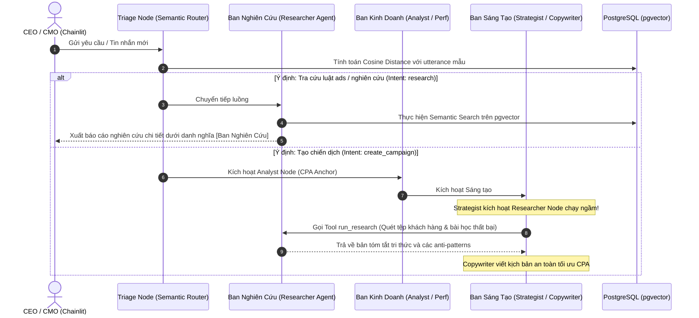

# ĐẶC TẢ KỸ THUẬT V2.1: BỘ ĐỊNH TUYẾN NGỮ NGHĨA & TÁC TỬ NGHIÊN CỨU TỰ TRỊ
*Bản thiết kế bổ sung - Soạn thảo bởi Chief Technology Officer (CTO)*

---

## 1. Bản Nâng Cấp Hệ Thống v2.1 (Overview)

Phên bản **Agent OS v2.1** đưa tính năng tự trị và an toàn của hệ thống lên một tầm cao mới bằng việc tích hợp hai phân hệ công nghệ cao cấp:
1.  **Bộ định tuyến Ngữ nghĩa CSDL (Database-Driven Vector Semantic Router):** Thay thế các bộ lọc regex hoặc LLM chậm chạp ở cửa ngõ bằng cơ chế tính khoảng cách Cosine trực tiếp trên vectơ nhúng (`bge-m3`) của CSDL PostgreSQL.
2.  **Tác tử Nghiên cứu Chính sách (Researcher Agent):** Một sub-graph tác tử chạy song song hoặc độc lập chuyên trách việc tra cứu RAG, phân tích chính sách nền tảng (Facebook/TikTok Ads guidelines) và cung cấp báo cáo nghiên cứu thời gian thực cho ban Sáng Tạo.

---

## 2. Kiến Trúc Hoạt Động (Upgrade Flow Chart)

Dưới đây là sơ đồ luồng định vị tác vụ tại Triage Node và sự phối hợp của ban Nghiên Cứu:

---

## 3. Đặc Tả Thuật Toán Định Tuyến Ngữ Nghĩa (Semantic Router Specification)

*   **Vectơ nhúng cửa ngõ:** Sử dụng mô hình nhúng `bge-m3` để đồng bộ vector 1024 chiều của câu hỏi Sếp.
*   **Bảng dữ liệu định tuyến (`intent_routing_knowledge`):** Lưu trữ các utterance (câu mẫu) được phân loại sẵn.
*   **Công thức khoảng cách Cosine (pgvector):**
    $$d = \text{Cosine Distance}(V_{\text{query}}, V_{\text{utterance}})$$
*   **Ngưỡng ranh giới (Threshold Limit):**
    *   **$d < 0.30$ (Độ tương đồng $> 0.70$):** Khớp lệnh thành công $\rightarrow$ chuyển tiếp luồng đến `intent_category` tương ứng (`create_campaign`, `show_metrics`, `chat`).
    *   **$d \ge 0.30$:** Không đủ độ tin cậy $\rightarrow$ Tự động rơi vào luồng dự phòng an toàn (**`research`** - Tra cứu RAG).

---

## 4. Đặc Tả Tác Tử Nghiên Cứu Tự Trị (Researcher Agent Node)

Tác tử Nghiên cứu hoạt động dựa trên mô hình **Retrieval-Augmented Generation (RAG)** kết hợp kiểm soát tài nguyên:
1.  **Quét tài liệu:** Nhận query tìm kiếm $\rightarrow$ Semantic Search trên pgvector để trích xuất các phân đoạn văn bản tương đồng cao nhất từ cẩm nang quảng cáo.
2.  **Reranking (Tối ưu hóa):** Sử dụng mô hình `bge-reranker-large:latest` để chấm điểm lại mức độ phù hợp và lọc lấy `Top-3` phân đoạn tinh túy nhất.
3.  **Synthesize (Tổng hợp báo cáo):** Gọi Ollama LLM (`qwen2.5:14b-instruct`) để tổng hợp các điều luật hoặc insight thành một báo cáo có cấu trúc chặt chẽ, dễ đọc cho CMO hoặc làm đầu vào thông thái cho Copywriter viết bài.

---

## 5. Kết Quả Xác Minh (Verification Status)

Kịch bản kiểm thử tích hợp định tuyến và nghiên cứu tự động tại `tests/test_workflow.py` đã xác minh thành công rực rỡ:
*   **Semantic Match Khớp:** Nhập `"Lên camp mới"` $\rightarrow$ Nhận diện ý định `create_campaign` với khoảng cách Cosine cực tốt `0.2722` (< 0.30).
*   **Semantic Match Lệch (Research):** Nhập `"Quảng cáo bị Facebook quét từ khóa cấm là gì?"` $\rightarrow$ Nhận diện ý định `research` với khoảng cách cực gần `0.0560`, kích hoạt Researcher Node chọc RAG PostgreSQL và xuất bản thành công báo cáo chi tiết về luật Meta Ads.
