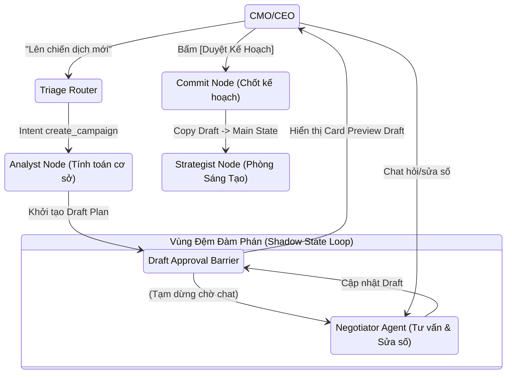

# TÀI LIỆU THIẾT KẾ KỸ THUẬT: SHADOW STATE & VÒNG LẶP ĐÀM PHÁN KPI
**Chức vụ chịu trách nhiệm:** Chief Technology Officer (CTO)  
**Dành cho:** Đội ngũ Kỹ sư Phát triển (Core Developers)  
**Mục tiêu:** Nâng cấp cấu trúc LangGraph, chuyển từ mô hình "Straight-through" (Chạy thẳng) sang "Double-Barrier" (Trạm kiểm soát kép) với cơ chế Draft Plan ảo.

---

## 1. Triết Lý Kiến Trúc (Architecture Philosophy)

Hệ thống v3.0 sẽ áp dụng triết lý **"State Isolation" (Cô lập Trạng thái)** thông qua khái niệm **Shadow State (Kế hoạch Ảo)**. 
Thay vì AI phân tích (Analyst) ghi đè trực tiếp tham số sống còn (Target CPA, Budget) vào bộ nhớ trung tâm (`AgencyState`) và chuyển ngay cho phòng Sáng Tạo, hệ thống sẽ:
1. Sinh ra một bản Nháp (Draft Plan) lưu trong Shadow State.
2. Tạm dừng đồ thị (Interrupt).
3. Cho phép CMO tương tác, hỏi đáp, đàm phán với một **Negotiator Agent** (Biết suy luận toán học và tư vấn).
4. Chỉ khi CMO bấm "Duyệt & Khởi chạy" (Commit), dữ liệu từ Shadow State mới được đổ vào Main State và bàn giao cho phòng Sáng Tạo.

---

## 2. Sơ Đồ Luồng Hoạt Động (Data & Control Flow)

Dưới đây là sơ đồ luồng LangGraph thể hiện rõ sự cô lập và vòng lặp đàm phán:



---

## 3. Cấu Trúc Dữ Liệu Bộ Nhớ (State Structure)

Tệp `graphs/state.py` cần được cập nhật cấu trúc `AgencyState` để hỗ trợ vùng đệm Sandbox.

```python
from typing import TypedDict, List, Dict, Any, Optional
from langchain_core.messages import BaseMessage
import operator
from typing_extensions import Annotated

class DraftPlan(TypedDict):
    """Cấu trúc của Shadow State (Kế hoạch Ảo)"""
    test_budget: float
    target_cpa: float
    margin: float
    status: str # "draft", "negotiating", "committed"
    notes_for_creative: str

class AgencyState(TypedDict):
    messages: Annotated[List[BaseMessage], operator.add]
    current_channel: str
    workspace_id: str
    campaign_id: str
    product_id: str
    
    # --- GLOBAL STATE THẬT (Chỉ được ghi sau khi Commit) ---
    target_cpa: float
    test_budget: float
    
    # --- SHADOW STATE (Sandbox cho Đàm phán) ---
    draft_plan: Optional[DraftPlan]
    
    # ... (Các state cũ giữ nguyên)
    sop_stage: str 
    intent_classification: str
```

---

## 4. Đặc Tả Tác Tử Đàm Phán (Negotiator Agent)

Node `negotiator_node` đóng vai trò là "Giám đốc Hiệu suất Ảo". Hoạt động theo cơ chế **ReAct (Reason + Act)**.

### A. Công cụ hỗ trợ (Tool Calling)
Định nghĩa một Pydantic Schema để Ollama (Qwen2.5) có thể thao tác với Shadow State:

```python
from pydantic import BaseModel, Field

class UpdateDraftPlanTool(BaseModel):
    """Công cụ cập nhật Bản nháp Kế hoạch Kinh doanh"""
    test_budget: Optional[float] = Field(None, description="Ngân sách chạy thử mới (VND)")
    target_cpa: Optional[float] = Field(None, description="CPA mục tiêu mới (VND)")
    notes_for_creative: Optional[str] = Field(None, description="Ghi chú thêm cho phòng Sáng tạo")
```

### B. System Prompt (Logic Suy luận)
```text
Bạn là Giám đốc Hiệu suất (Performance Director). Đang thảo luận Bản nháp Kế hoạch (Draft Plan) với CMO.
- Giá bán SP: {price} | Giá vốn: {cost} | Lợi nhuận gộp: {margin}
- Trạng thái Nháp hiện tại: Ngân sách {budget}, Target CPA {cpa}. (Dự kiến mang về {leads} đơn).

NHIỆM VỤ:
1. TRẢ LỜI CÂU HỎI TƯ VẤN: Nếu CMO hỏi "Ngân sách này có ổn không?", "CPA này có mỏng không?". KHÔNG gọi Tool. Hãy phân tích toán học dựa trên Lợi nhuận gộp và số lượng Lead (Ngân sách / CPA) để xem Facebook có đủ data thoát Learning Phase không (cần ~10-50 leads).
2. THỰC THI MỆNH Lệnh: Nếu CMO yêu cầu sửa số ("Tăng lên 5 củ", "Ép CPA xuống 100k"). Hãy gọi Tool `UpdateDraftPlanTool` để cập nhật hệ thống, sau đó báo cáo lại ngắn gọn.
Giữ thái độ sắc bén, tôn trọng Sếp nhưng phải bảo vệ số liệu kinh tế.
```

---

## 5. Đặc Tả Giao Diện Kỹ Thuật (Chainlit UI Hooks)

Phía Client (UI) cần bắt được trạng thái Graph đang dừng tại `draft_approval_barrier` để render giao diện tương tác:

1.  **Render Draft Card:** Khi Graph paused, bắn ra một `cl.Message` chứa Bảng Markdown tổng hợp các thông số của `state["draft_plan"]`.
2.  **Render Action Buttons:** Kèm theo 2 nút:
    *   `[💬 Tiếp tục đàm phán]` (Chỉ là UI hint, thực tế người dùng cứ chat bình thường).
    *   `[🚀 Chốt Kế Hoạch & Giao Phòng Sáng Tạo]` (Gắn với action callback `commit_draft_plan`).
3.  **Callback `commit_draft_plan`:**
    *   Cập nhật state: Chuyển dữ liệu từ `draft_plan` sang `target_cpa` và `test_budget` thật.
    *   Cập nhật `sop_stage` = `creative_generation`.
    *   Resume LangGraph để tiếp tục chạy vào `strategist_node`.

---
*Tài liệu này là cơ sở để đội ngũ kỹ thuật triển khai bản nâng cấp hệ thống (Patch v3.1).*
