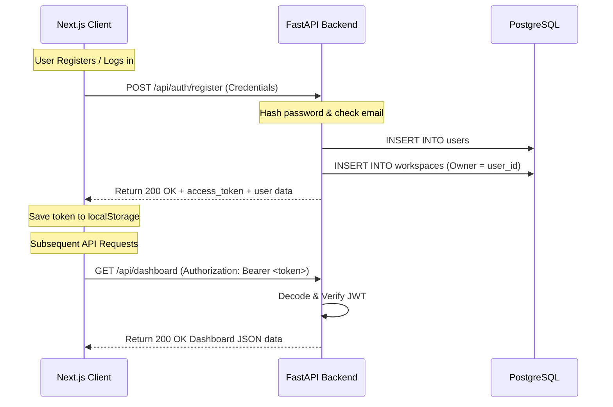

# 06_AUTHENTICATION_SYSTEM.md (AI-Agent Oriented Architecture Documentation)

> **For AI Agents:** Use this document to understand the authentication architecture, security layers, code dependency chains, and testing protocols of the Marketing Agent OS User Authentication System.

---

## 1. Architectural Overview

The system implements a stateless, token-based user authentication design:
- **Backend (FastAPI)**: Validates credentials, issues JWT (JSON Web Tokens) encoded via HS256, hashes passwords using bcrypt via `passlib`, and enforces role-based endpoint access control.
- **Frontend (Next.js)**: Persists tokens in `localStorage`, encapsulates session state via React Context API (`AuthContext`), handles automatic header injection in outgoing HTTP calls, and triggers routing redirects using a Higher-Order layout wrapper (`AuthGuard`).
- **Multi-Tenant Integration**: New user registration automatically creates a default personal workspace in the `workspaces` table and assigns it to the user.



---

## 2. Backend Subsystems

### A. Core Utility Functions
- **File Location**: [core/auth.py](file:///wsl.localhost/server/root/marketing/marketing-agent-os/core/auth.py)
- **Dependencies**: `PyJWT`, `passlib[bcrypt]`, `bcrypt`
- **Agent Note — Bcrypt Monkeypatching**: Passlib has a known bug when paired with newer versions of `bcrypt` (>= 4.0.0) resulting in `ValueError: Invalid ident`. The top of `core/auth.py` dynamically monkeypatches `bcrypt.hashpw` and `passlib.handlers.bcrypt.detect_wrap_bug` to prevent compilation/runtime crashes. Do not remove this monkeypatch.
- **API Constants**:
  - `JWT_SECRET_KEY`: Env variable `JWT_SECRET_KEY` (default: `"super_secret_jwt_key_marketing_agent_os_2026"`).
  - `JWT_ALGORITHM`: Default `"HS256"`.
  - `ACCESS_TOKEN_EXPIRE_MINUTES`: Default `1440` (24 Hours).
- **Functions**:
  - `hash_password(password: str) -> str`: Generates bcrypt hash.
  - `verify_password(plain_password: str, hashed_password: str) -> bool`: Verifies plain password against hash.
  - `create_access_token(data: dict, expires_delta: Optional[timedelta] = None) -> str`: Generates a JWT with claims, encoding expiration `exp` as a UTC timestamp.
  - `decode_access_token(token: str) -> Optional[dict]`: Decodes JWT, validating expiration. Returns `None` if invalid or expired.

### B. Dependency Injection Layer
- **File Location**: [core/dependencies.py](file:///wsl.localhost/server/root/marketing/marketing-agent-os/core/dependencies.py)
- **Functions**:
  - `get_current_user(token: str = Depends(oauth2_scheme), db: Session = Depends(get_db)) -> User`: Protected route dependency. Extracts sub (email) claim from JWT, queries `users` table, and returns the User object. Raises `HTTP_401_UNAUTHORIZED` if token is invalid or user is not found.
  - `get_current_admin_user(current_user: User = Depends(get_current_user)) -> User`: Enforces `role == "admin"`. Raises `HTTP_403_FORBIDDEN` if fails.
  - `get_current_workspace(request: Request, db: Session = Depends(get_db), current_user: User = Depends(get_current_user)) -> Workspace`: Enforces tenant-level security. Looks up workspace ID via header `X-Workspace-Id` or query parameter `workspace_id`. Verifies the user has access (`current_user.id == workspace.owner_id` or `current_user.id` in `workspace.members`). Raises `HTTP_403_FORBIDDEN` if validation fails.

### C. Authentication Routes
- **File Location**: [api/auth_routes.py](file:///wsl.localhost/server/root/marketing/marketing-agent-os/api/auth_routes.py)
- **Endpoints**:
  - `POST /api/auth/register`:
    - Receives `UserRegisterSchema` (name, email, password).
    - Checks for existing email in DB.
    - Hashes password.
    - Saves user.
    - Creates a new Workspace named `"{user.name}'s Workspace"` with `owner_id = user.id` and updates members.
    - Returns JWT `access_token` and `user` profile data.
  - `POST /api/auth/login`:
    - Supports JSON body (`UserLoginSchema`) **and** OAuth2 Form data (`OAuth2PasswordRequestForm`).
    - Validates credentials and returns JWT `access_token` and `user` payload.
  - `GET /api/auth/me`:
    - Protected by `get_current_user`. Returns the logged-in user profile details.

---

## 3. Frontend Subsystems (Next.js)

### A. Context State Management
- **File Location**: [frontend/src/contexts/AuthContext.tsx](file:///wsl.localhost/server/root/marketing/marketing-agent-os/frontend/src/contexts/AuthContext.tsx)
- **State**:
  - `user`: `User | null` (stores authenticated user details).
  - `token`: `string | null` (stores JWT).
  - `loading`: `boolean` (state initialization loader).
- **Functions**:
  - `login(payload)`: Submits credentials to `/api/auth/login`, saves JWT in `localStorage`, sets state, and redirects to dashboard (`/`).
  - `register(payload)`: Submits registration schema to `/api/auth/register`, saves JWT, sets state, and redirects to dashboard.
  - `logout()`: Clears `localStorage` JWT, resets React states, and redirects to `/login`.
- **Handoff Mechanism**:
  - On mount, the Provider runs `initializeAuth()`: checks `localStorage` for `token`, calls `authApi.getMe()` using the token, and populates the `user` state. If token validation fails, cleans up the cached token automatically.
  - Registers the `logout` handler globally with the API fetch module via `registerLogoutHandler(logout)`. This enables the networking client to trigger logouts upon receiving `401 Unauthorized` status responses.

### B. Networking Client Extension
- **File Location**: [frontend/src/lib/api.ts](file:///wsl.localhost/server/root/marketing/marketing-agent-os/frontend/src/lib/api.ts)
- **Header Injection**: Intercepts outgoing client HTTP fetch calls to automatically attach the stored token to the headers:
  ```typescript
  const token = localStorage.getItem('token');
  if (token) {
    headers['Authorization'] = `Bearer ${token}`;
  }
  ```
- **Error Interception**: If an API call fails with status `401`, it automatically invokes the registered `logoutHandler()` to flush the token and redirect the client to `/login`.

### C. Route Guard Wrapper
- **File Location**: [frontend/src/components/AuthGuard.tsx](file:///wsl.localhost/server/root/marketing/marketing-agent-os/frontend/src/components/AuthGuard.tsx)
- **Usage**: Encapsulates pages (such as `/` and `/cockpit`) inside layout contexts to block unauthenticated sessions.
- **Redirection**: On state check (`!loading && !user`), triggers client redirect to `/login`. Displays a visual, animated loader overlay during verification transitions.

---

## 4. Operational & Extension Guidelines for Agents

### How to protect a new FastAPI endpoint:
Import `get_current_user` and add it as a FastAPI `Depends` dependency:
```python
from fastapi import APIRouter, Depends
from core.dependencies import get_current_user
from core.models import User

router = APIRouter()

@router.get("/api/secured-feature")
async def secure_endpoint(user: User = Depends(get_current_user)):
    return {"message": f"Hello {user.name}, you are authenticated!"}
```

### How to protect a new Frontend route:
Open the target route file (e.g. `src/app/my-new-feature/page.tsx`) and wrap the view layout inside `<AuthGuard>`:
```tsx
import AuthGuard from '@/components/AuthGuard';

export default function MyNewFeature() {
  return (
    <AuthGuard>
      <div>Secure Admin Panels here...</div>
    </AuthGuard>
  );
}
```

---

## 5. Verification & Testing Playbook

### Running Backend Tests
Ensure you are in the WSL environment where package dependencies are loaded:
```bash
wsl python3 -m pytest tests/test_auth.py
```
- **File tested**: [tests/test_auth.py](file:///wsl.localhost/server/root/marketing/marketing-agent-os/tests/test_auth.py)
- **Checkpoints**: Password hashing strength, registration workflows, JWT header injection, invalid payloads, role-based blocking, and default workspace initialization.

### Verifying Frontend Builds
Check compilation cleanly:
```bash
wsl npm run build
```
- **Compile Gates**: Next.js production compiler verifies types, checks syntax across `/login`, `/register`, layout wrappers, and ensures pre-existing pages compilation checks successfully pass.
