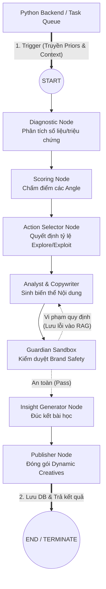

# Sơ đồ Kiến trúc Đồ thị (Stateless Graph Architecture v3.0)

Tài liệu này mô tả luồng thực thi đồ thị LangGraph của hệ thống Marketing Agent OS. Theo định hướng Enterprise, đồ thị này được thiết kế theo chuẩn **Stateless Execution Layer (Không lưu trạng thái dài hạn)**.

Mọi node chờ đợi con người (Human-in-the-loop) chặn ngang luồng (interrupt_before) đã bị loại bỏ hoàn toàn.

---

## 1. Sơ đồ Thực thi Vòng lặp (The Execution Pipeline)

Đồ thị chỉ được kích hoạt (Trigger) bởi Backend Python sau khi đã hoàn tất việc tính toán trọng số toán học (Priors) từ OLAP Database.



---

## 2. Giải phẫu các Node Tự trị (Autonomous Nodes)

*   **`diagnostic_node`**: Nhận `current_metrics` từ Backend truyền vào để chuyển hóa số liệu thô (ví dụ: CPA cao) thành triệu chứng ngữ nghĩa. (Lưu ý: Cold-start bằng SQL sẽ được xử lý ở Backend, node này chỉ đọc kết quả).
*   **`scoring_node`**: Dựa trên `campaign_objective` (Mục tiêu chiến dịch) để thiết lập hàm Reward ảo, đánh giá độ hấp dẫn của các Angle tại thời điểm hiện tại.
*   **`action_selector_node`**: Là trái tim của đa dạng hóa. Nhận lệnh phải đẻ bao nhiêu bài, chia tỷ lệ 80% an toàn (Exploit) và 20% đột phá (Explore) và chỉ định thẳng cho Copywriter.
*   **`guardian_sandbox_node`**: Cốt lõi của an toàn thương hiệu. Chấm điểm rủi ro. Nếu fail, nó bắt vòng lại `CreativeGen`. Lỗi fail sẽ được đẩy vào RAG dưới dạng `sandbox_feedback` để Copywriter học thuộc lòng cho vòng sau.
*   **`insight_generator_node`**: LLM phân tích tại sao hôm nay nó lại chọn Action này, sinh ra đoạn text Insight. **Lưu ý:** Đoạn text này chỉ được lưu vào SQL (`ai_insights_pending`), tuyệt đối không tự chui vào RAG.
*   **`publisher_node`**: Node cuối cùng. Lưu mapping Variant-Ad vào `ad_mapper`. Bắn tín hiệu ra ngoài.

---

## 3. Cấu trúc Trạng thái (AgencyState)

Do tính chất Stateless, State không cộng dồn (Không dùng `operator.add` cho metrics) qua nhiều ngày. State sẽ bị hủy sau khi Graph chạy tới `END`.

```python
from typing import TypedDict, List, Dict, Any

class AgencyState(TypedDict):
    # --- EXTERNAL INPUTS (Từ Backend) ---
    campaign_objective: str
    current_metrics: Dict[str, Any]
    current_beliefs: Dict[str, Any] # Trọng số ưu tiên (Priors)
    
    # --- INTERNAL EXECUTION (Chỉ sống trong 1 vòng chạy) ---
    sop_stage: str
    selected_actions: List[str]      # Các góc độ được Bandits chọn
    generated_variants: List[Any]    # Content đẻ ra
    sandbox_feedbacks: List[str]     # Lý do bị Guardian chửi
```

## Tổng Kết
LangGraph không còn là một hệ thống "Ngâm" (Long-running process). Nó đã trở thành một Serverless Function: Nhận Data $\rightarrow$ Chạy toán học $\rightarrow$ Đẻ Content $\rightarrow$ Tự hủy. Kiến trúc này triệt tiêu hoàn toàn rủi ro Memory Leak và State Bloat ở cấp độ hệ thống lớn.