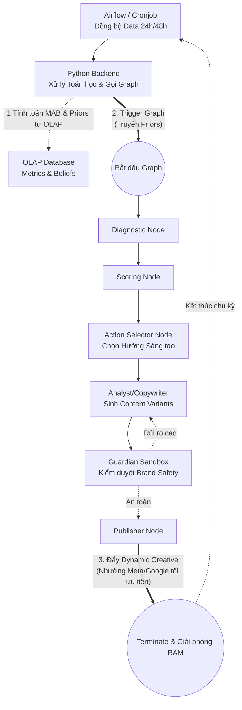

# Đề xuất Refactor: Mô hình Autonomous Agentic AI (Bản Enterprise Production-Ready)

Tài liệu này mô tả thiết kế kiến trúc để chuyển đổi hệ thống sang mô hình **Tự trị (Autonomous)** theo hướng **Creative Intelligence Engine (Động cơ Trí tuệ Sáng tạo)**, kết hợp giữa thuật toán Bandit nội bộ để đánh giá nội dung và Stateless Graph để đảm bảo khả năng mở rộng ở cấp độ Enterprise.

Thiết kế này đã được tinh chỉnh để tránh các rủi ro hệ thống như State Bloat, RAG Poisoning và xung đột thuật toán đấu thầu với nền tảng AdTech (Meta/Google).

---

## 1. Kiến trúc Stateless Execution (Đập bỏ Zombie Graphs)

LangGraph được sử dụng hoàn toàn như một **Stateless Execution Layer (Tầng Thực thi Không Trạng thái)**. Đồ thị sẽ không bao giờ "ngủ đông" (sleep/interrupt) để chờ số liệu nhằm tránh gây phình to bộ nhớ (State Bloat) và sập hệ thống.

- **Data Flow tách biệt:** Toàn bộ lịch sử (`metrics_history`) và trọng số niềm tin (`current_beliefs`) được quản lý bởi **OLAP Database (PostgreSQL/ClickHouse)**.
- **Workflow:**
  1. Backend Python (Cronjob/Airflow/Task Queue) kéo số liệu thực tế từ API Facebook/Google về OLAP DB.
  2. Backend Python chạy thuật toán Bandit tính toán lại trọng số.
  3. Backend trigger (gọi) LangGraph. Truyền `current_beliefs` mới nhất vào State.
  4. LangGraph chạy một lèo: *Diagnostic -> Analyst -> Guardian -> Publisher*.
  5. Khi Publisher xuất bản nội dung (lên kho lưu trữ hoặc nạp vào Ad Network làm Dynamic Creative), Graph lập tức `Terminate` (Kết thúc) và giải phóng RAM.

---

## 2. Hệ thống Node Tự trị (Autonomous Engine Nodes)

LangGraph đóng vai trò sáng tạo nội dung dựa trên chỉ đạo của Backend:

1. **`diagnostic_node`**: Đọc metrics được truyền vào từ Backend để xác định các vấn đề về nội dung (Triệu chứng).
2. **`scoring_node`**: Đánh giá các hướng tiếp cận nội dung (Angles) dựa trên trọng số hiện tại.
3. **`action_selector_node`**: Không can thiệp vào ngân sách Ads. Nhiệm vụ của nó là chọn ra tổ hợp các "Hành động Sáng tạo" (vd: đổi Headline, đổi góc Tâm lý) để Agent viết bài, nhằm tạo ra mẻ biến thể (Variants) tốt nhất.
4. **`guardian_sandbox_node` (Safe Exploration)**: Dù AI muốn thử nghiệm nội dung mới, nội dung đó vẫn phải qua AI Brand Guardian chấm điểm rủi ro. Nếu vi phạm, đánh rớt ngay trong quá trình sinh nội dung.
5. **`publisher_node`**: Gửi mẻ nội dung (Content Variants) sang nền tảng Quảng cáo dưới dạng *Dynamic Creative*. Nhường việc tối ưu ngân sách (Bidding) cho Machine Learning của Meta/Google.

---

## 3. Xử lý "Cold-Start" an toàn (Không dùng Vector RAG)

Với một thương hiệu/chiến dịch mới tinh, thuật toán Bandit cần điểm tựa. Để tránh hiện tượng "Ảo giác suy luận" (Epistemic Collapse), hệ thống không dùng RAG (Semantic Search) cho số liệu.

- **Giải pháp:** Sử dụng **SQL Query truyền thống** trên OLAP Database.
- **Thực thi:** Tìm trung bình (Average) các metrics từ các chiến dịch tương tự trong quá khứ (cùng Ngành hàng, cùng Mục tiêu) để thiết lập `current_beliefs` (Priors). Chỉ mồi bằng dữ liệu cứng (Hard Data), không mồi bằng văn bản huyễn hoặc.

---

## 4. Sơ đồ Hệ thống Enterprise (Event-Driven & Stateless)



## 5. Cấu trúc State (Stateless Graph State)

Do tính chất Stateless, Graph State chỉ chứa dữ liệu phục vụ cho **một lần chạy duy nhất (Single Execution)**:

```python
class AgencyState(TypedDict):
    # Context từ Backend bơm vào
    campaign_objective: str
    current_metrics: dict         # Chỉ chứa số liệu của mẻ gần nhất
    current_beliefs: dict         # Trọng số nhận từ Backend
    
    # Dữ liệu nội bộ sinh ra trong quá trình chạy
    sop_stage: str
    selected_actions: list        # Hướng sáng tạo được chọn
    generated_variants: list      # Danh sách nội dung sinh ra
    sandbox_feedbacks: list       # Lỗi từ Guardian
```

## Tổng kết Lộ trình Triển khai
1. Tách logic tính toán Bandits và tích lũy Data ra khỏi LangGraph, chuyển sang Backend và OLAP DB.
2. Cập nhật `AgencyState` thành dạng Stateless.
3. Thiết kế luồng Publisher đẩy nội dung lên Ad Network (hoặc kho lưu trữ) dưới dạng Dynamic Creative.
4. Gỡ bỏ mọi `interrupt_before` gây block luồng thực thi trong LangGraph.