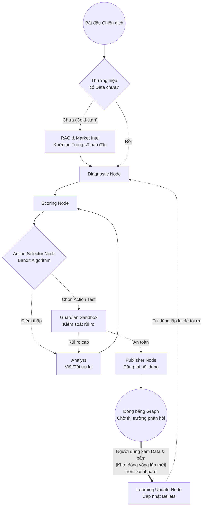

# Đề xuất Refactor: Mô hình Autonomous Agentic AI (Bản Production-Ready)

Tài liệu này mô tả thiết kế kiến trúc để chuyển đổi hệ thống sang mô hình **Tự trị (Autonomous) dựa trên thuật toán Bandit và Vòng lặp học tập (Closed-loop learning)**. 

Dựa trên các đánh giá của Lead AI, thiết kế này đã được nâng cấp để xử lý các bài toán thực tế (Edge cases) như: Khởi động lạnh (Cold-Start), Quản trị rủi ro thử nghiệm, và Độ trễ thời gian của dữ liệu thật.

---

## 1. Xử lý "Cold-Start" (Khởi tạo Niềm tin ban đầu)

Với một thương hiệu mới chưa từng có dữ liệu lịch sử, thuật toán Bandit sẽ không thể ra quyết định. 
- **Giải pháp:** Thêm bước mồi dữ liệu (Warm-up Priors).
- **Thực thi:** Trước khi vào `Diagnostic Node`, nếu `metrics_history` trống, hệ thống sẽ gọi **Market Intelligence Node** và **RAG Knowledge Base** để tìm kiếm cách làm của đối thủ hoặc các chiến dịch tương tự trong quá khứ, từ đó khởi tạo một bộ `current_beliefs` (trọng số ban đầu) thay vì bắt đầu từ con số 0.

---

## 2. Hệ thống Node Tự trị (Autonomous Engine Nodes)

Hệ thống sử dụng các Node ra quyết định xác suất thay cho con người:

1. **`diagnostic_node`**: Đọc metrics hiện tại (hoặc từ mẻ test trước) -> Chuyển thành triệu chứng (vd: CTR thấp).
2. **`scoring_node`**: Gán điểm Xác suất (Probability), Độ ảnh hưởng (Impact) và Chi phí (Cost).
3. **`action_selector_node`**: Sử dụng thuật toán Bandit (Epsilon-Greedy / Thompson Sampling) để chọn hành động (Exploit để an toàn, hoặc Explore để thử nghiệm).
4. **`guardian_sandbox_node` (Safe Exploration)**: Dù thuật toán chọn test một nội dung mới (Explore), nội dung đó vẫn phải đi qua AI Brand Guardian để chấm điểm rủi ro. Nếu rủi ro vi phạm thương hiệu quá cao, đánh rớt và quay lại vòng tạo nội dung.
5. **`learning_update_node`**: Cập nhật lại `current_beliefs` dựa trên kết quả chạy thật.

---

## 3. Vòng lặp Học tập Bất đồng bộ & Vai trò của Dashboard (Quan trọng)

Thuật toán yêu cầu một vòng lặp: *Đăng bài -> Lấy kết quả -> Học -> Sửa*.
Tuy nhiên, trong thực tế, đăng bài xong cần **đợi một khoảng thời gian (VD: 24h - 48h)** mới có số liệu trả về từ Facebook/Google Ads. Do đó, đồ thị LangGraph **không thể loop liên tục ngay lập tức**.

**Giải pháp chốt chặn tại Dashboard (Event-Driven Trigger):**
1. Giao diện Chat truyền thống sẽ được loại bỏ/ẩn đi. Thay vào đó là một **Dashboard Quản trị Chiến dịch**.
2. Tại `Publisher Node`, sau khi bài viết/Ads được đẩy đi, LangGraph sẽ đi vào một chốt chặn `interrupt_before` có tên là `waiting_for_metrics`. Trạng thái graph được "đóng băng" (lưu vào Database).
3. **Tracking trên Dashboard:** Trong suốt quá trình các Agent chạy (từ phân tích, chọn bandit, đến viết bài), Dashboard sẽ hiển thị logs chi tiết theo thời gian thực (Real-time tracking) để người dùng thấy rõ AI đang "nghĩ gì" và "làm gì".
4. **Nút "Khởi động Vòng lặp" (Start Next Iteration):** Sau 1-2 ngày, khi dữ liệu Ads/Social đã thu thập đủ, người dùng vào Dashboard, xem xét dữ liệu và bấm nút **"Khởi động vòng lặp tiếp theo"**. 
5. Hành động click này sẽ truyền `metrics` mới nhất vào Graph, đánh thức luồng làm việc, đi qua `learning_update_node` để AI tự "rút kinh nghiệm", và vòng lại `diagnostic_node` để bắt đầu mẻ tối ưu mới.

---

## 4. Sơ đồ LangGraph Mới (Bản Production)



---

## 5. Cấu trúc State (Global State)

Để hệ thống học được theo thời gian, cấu trúc dữ liệu toàn cục cần thay đổi:

```python
class AgencyState(TypedDict):
    # Lịch sử hội thoại (nếu cần thiết cho context)
    messages: Annotated[Sequence[BaseMessage], operator.add]
    sop_stage: str
    
    # Dữ liệu phục vụ Học máy (Bandit & Bayesian)
    # Dùng operator.add để cộng dồn lịch sử các lần chạy
    metrics_history: Annotated[list, operator.add] 
    
    # Trọng số niềm tin hiện tại (Ví dụ: {"headline_A": 0.6, "video_B": 0.4})
    current_beliefs: dict 
    
    # Quyết định hành động hiện tại được chọn bởi Bandit
    selected_action: dict
    
    # Số liệu trả về sau khi người dùng bấm nút trên Dashboard
    latest_feedback_metrics: dict 
```

## Tổng kết Lộ trình Triển khai
1. Cập nhật `AgencyState`.
2. Viết hàm `Action Selector` tích hợp thư viện Bandit.
3. Thay thế chat UI bằng Dashboard UI: Đổ log chi tiết của các Agent ra màn hình.
4. Đặt `interrupt_before=["waiting_for_metrics"]` sau Node Publisher. Kích hoạt lại (Resume) Graph thông qua nút bấm trên UI truyền kèm payload số liệu.