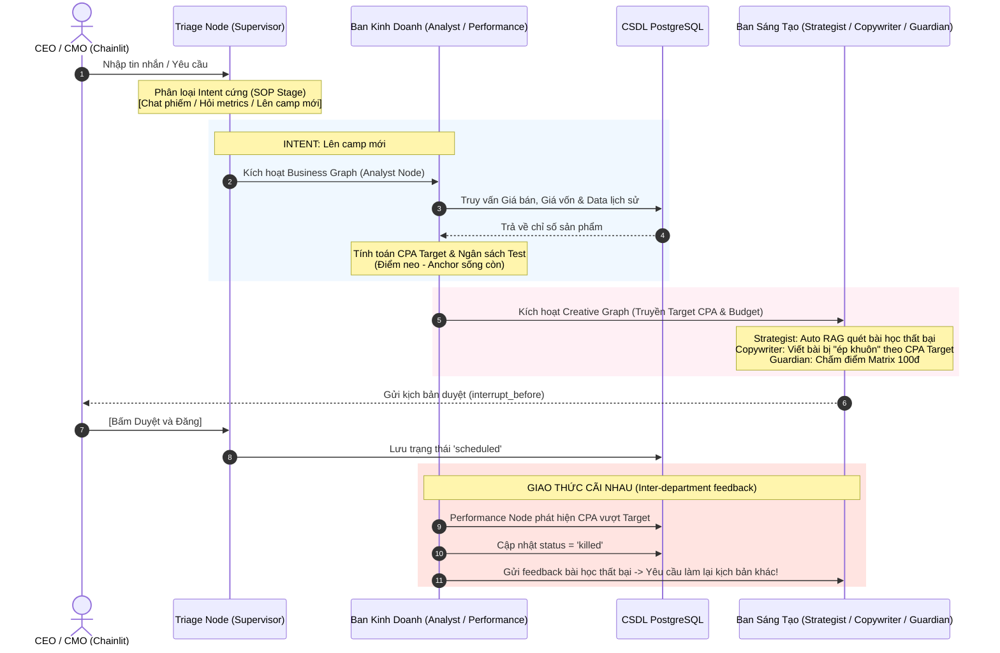

# KẾ HOẠCH TRIỂN KHAI: MARKETING AGENT OS v2.0 (IMPLEMENTATION PLAN)

Tài liệu này trình bày phương án kỹ thuật nâng cao và quy trình vận hành tiêu chuẩn (SOP - Standard Operating Procedure) cho hệ thống **Marketing Agent OS v2.0** nhằm đảm bảo tính tự trị an toàn, kỷ luật tri thức và luồng xử lý chặt chẽ.

---

## 1. QUY TRÌNH VẬN HÀNH TIÊU CHUẨN (STANDARD OPERATING PROCEDURES - SOP)

Để tránh hiện tượng Agent tự ý chạy vô định hoặc ảo giác, hệ thống thiết lập một **SOP 4 bước cứng** từ khâu tiếp nhận yêu cầu đến thực thi và phản hồi ngược:



---

## 2. CHI TIẾT 3 ĐIỂM CHỐT VÀ SOP MỚI

### 2.1. Triage Node (Bộ não phân loại ở cửa ngõ)
Mọi tin nhắn từ Chainlit bắt buộc đi qua **Triage Node** trước tiên. Node này sử dụng cấu trúc prompt phân loại Intent cứng để định hướng luồng:
1.  **Intent `chat` (Trò chuyện phiếm):** LLM phản hồi trực tiếp, kết thúc luồng ngay lập tức. Tiết kiệm tối đa token và tài nguyên hệ thống.
2.  **Intent `show_metrics` (Hỏi số liệu):** Router chuyển sang `Business Graph`. Analyst Node gọi Tool để query database PostgreSQL và trả ra báo cáo hiệu năng.
3.  **Intent `create_campaign` (Giao việc/Tạo chiến dịch mới):** Router kích hoạt chuỗi SOP tuần tự qua cả hai ban.

### 2.2. Điểm chốt 1: Điểm neo CPA & Budget (Business Graph Anchor)
Khi nhận lệnh `create_campaign`, `Analyst Node` bắt buộc phải tính toán thành công 2 thông số sống còn:
*   **Formula tính Target CPA:** 
    $$\text{Target CPA} = (\text{Giá bán} - \text{Giá vốn}) \times \text{Tỷ lệ biên lợi nhuận cấu hình (mặc định 0.3)}$$
*   **Ngân sách thử nghiệm (Test Budget):** Lấy từ cấu hình `budget_limit` được duyệt bởi sếp hoặc cấu hình mặc định của Workspace.
*   **Luật kỷ luật:** Nếu `target_cpa` hoặc `test_budget` có giá trị `null` hoặc $\le 0$ sau bước này, **hệ thống bắt buộc phải dừng luồng ngay lập tức** và báo lỗi lên UI: *"Lỗi: Không tìm thấy dữ liệu giá bán/giá vốn của sản phẩm, không thể xác định CPA Target. Quy trình bị hủy bỏ."*

### 2.3. Điểm chốt 2: Sáng tạo "ép khuôn" theo Target CPA (Creative Graph Constraints)
Khi `Creative Graph` làm việc, prompt của `Copywriter Node` sẽ bị gò bó trong khung giới hạn từ ban kinh doanh:
*   **Biến State bắt buộc truyền vào:** `{target_cpa}` và `{test_budget}`.
*   **Cấu trúc Prompt gò cứng:**
    ```
    Nhiệm vụ: Bạn là Copywriter. Bạn có ngân sách chạy thử nghiệm là {test_budget} VNĐ.
    Yêu cầu tối thượng: Viết ra 3 kịch bản sao cho chi phí chuyển đổi (CPA) dự kiến dưới {target_cpa} VNĐ/đơn hàng.
    Phương thức: Áp dụng 3 góc tiếp cận tâm lý học khác nhau, lồng ghép khéo léo USP của sản phẩm để tối ưu hóa tỷ lệ chuyển đổi, giữ CPA trong mức cho phép.
    ```

### 2.4. Điểm chốt 3: Giao thức phản hồi ngược & Kỷ luật RAG cứng
#### A. Giao thức cãi nhau (Inter-department Feedback Loop)
 tiếp nối quy trình khi chạy Ads thực tế:
1.  Định kỳ hằng ngày, `Performance Node` truy vấn chỉ số Ads từ DB.
2.  Nếu phát hiện một kịch bản quảng cáo (Variant X) có `CPA thực tế > Target CPA` $\rightarrow$ Tự động chuyển `publish_status` sang `'killed'`.
3.  Tạo payload phản hồi ngược chứa: `variant_id`, `failed_copy`, `failed_cpa`, `reason_killed` $\rightarrow$ Đẩy vào mảng `killed_variants_feedback` trong `AgencyState`.
4.  `Main Router` phát hiện `killed_variants_feedback` không rỗng $\rightarrow$ Tự động kích hoạt lại `Creative Graph` ở luồng ngầm $\rightarrow$ Prompt của `Copywriter` nhận được thông tin: *"Kịch bản cũ (Variant X) đã bị Ban Kinh Doanh khai tử do CPA thực tế đạt {failed_cpa} vượt ngưỡng cho phép {target_cpa}. Hãy viết một kịch bản thay thế bằng một Angle hoàn toàn mới để tránh thất bại."*

#### B. Kỷ luật RAG bằng Code (Python-Enforced RAG)
Không tin tưởng việc LLM tự giác gọi Tool đọc RAG. Hệ thống cấu hình quy trình dán thông tin tự động bằng Python:
1.  Trước khi `Strategist Node` chạy, Python code sẽ truy vấn pgvector để tìm kiếm Top-3 "Bài học thất bại" (`category = 'anti_patterns'`) liên quan đến sản phẩm hiện tại.
2.  Python backend tự động dán đoạn markdown sau vào đầu **System Message** của Strategist:
    ```markdown
    ## CÁC BÀI HỌC THẤT BẠI CẦN TRÁNH (BẮT BUỘC TUÂN THỦ)
    1. Kịch bản từng thất bại: [Nội dung kịch bản cũ...]
       - Lý do thất bại: CPA thực tế đạt 220k (Target CPA là 150k) - Hook quá yếu.
    2. ...
    Tuyệt đối không lặp lại các lối tư duy, từ khóa hoặc hướng tiếp cận trên!
    ```

---

## 3. THIẾT KẾ CƠ SỞ DỮ LIỆU & BỘ NHỚ LƯU TRỮ (PGVECTOR + MINIO)

### 3.1. Kích hoạt Extension pgvector & Bảng Tri Thức (RAG Tables)
Vector dimension được cấu hình là `1024` tương thích hoàn toàn với model `bge-m3` của Ollama.
```sql
CREATE EXTENSION IF NOT EXISTS vector;

CREATE TABLE rag_knowledgebase (
    id UUID PRIMARY KEY DEFAULT gen_random_uuid(),
    workspace_id UUID REFERENCES workspaces(id) ON DELETE CASCADE,
    category VARCHAR(50) NOT NULL, -- 'economics', 'psychology', 'anti_patterns', 'user_upload'
    source_name VARCHAR(255),      -- Tên file tài liệu gốc (VD: 'Content_Guidelines.pdf')
    content TEXT NOT NULL,
    metadata JSONB,
    embedding VECTOR(1024),
    created_at TIMESTAMP WITH TIME ZONE DEFAULT CURRENT_TIMESTAMP
);

-- HNSW Index hỗ trợ Semantic Search siêu tốc
CREATE INDEX ON rag_knowledgebase USING hnsw (embedding vector_cosine_ops);
```

### 3.2. Cấu hình MinIO Object Storage
MinIO được thiết lập qua `docker-compose.yml` để cung cấp môi trường S3 local. 
*   **Bucket mặc định:** `marketing-assets`
*   **PostgreSQL Mapping:** Bảng `media_assets` và các tệp tin RAG tải lên sẽ được lưu trữ với `file_key` (ví dụ: `workspaces/ws1/knowledge/Choosing_Objective.pdf`) và URL để tải/xem lại nếu cần.

---

## 4. BẬT MÃ STATE ĐỒ THỊ CHÍNH THỨC

### 4.1. Trạng Thái Toàn Cục (`AgencyState`)
```python
from typing import TypedDict, List, Annotated, Dict, Any
from langchain_core.messages import BaseMessage
import operator

class AgencyState(TypedDict):
    messages: Annotated[List[BaseMessage], operator.add]
    current_channel: str                 # '#phong-kinh-doanh' hoặc '#phong-sang-tao'
    workspace_id: str
    campaign_id: str
    product_id: str
    target_cpa: float                    # Điểm neo sống còn
    test_budget: float                   # Điểm neo sống còn
    killed_variants_feedback: List[Dict[str, Any]] # Giao thức cãi nhau
    sop_stage: str                       # 'triage', 'cpa_calculation', 'creative_generation', 'waiting_approval'
```

### 4.2. File cấu hình dự án mẫu `docker-compose.yml`
```yaml
version: '3.8'
services:
  postgres:
    image: pgvector/pgvector:pg16
    container_name: agent_postgres
    environment:
      POSTGRES_DB: marketing_agent_db
      POSTGRES_USER: postgres
      POSTGRES_PASSWORD: secret_password
    ports:
      - "5432:5432"
    volumes:
      - pgdata:/var/lib/postgresql/data
    networks:
      - agent_network

  minio:
    image: minio/minio:latest
    container_name: agent_minio
    environment:
      MINIO_ROOT_USER: minioadmin
      MINIO_ROOT_PASSWORD: minioadminpassword
    ports:
      - "9000:9000"
      - "9001:9001"
    volumes:
      - miniodata:/data
    command: server /data --console-address ":9001"
    networks:
      - agent_network

volumes:
  pgdata:
  miniodata:

networks:
  agent_network:
    driver: bridge
```

---

## 5. DANH MỤC FILE & THƯ MỤC CẦN KHỞI TẠO (PROPOSED PROJECT STRUCTURE)

```
marketing-agent-os/
│
├── docker-compose.yml              # PostgreSQL (pgvector), MinIO Object Storage
├── requirements.txt                # Thư viện Python (LangGraph, Chainlit, SQLAlchemy, pgvector, boto3, pypdf)
│
├── db/
│   ├── __init__.py
│   ├── connection.py               # Kết nối PostgreSQL sử dụng SQLAlchemy
│   ├── schema.sql                  # File DDL khởi tạo toàn bộ CSDL v2.0
│   └── seed.py                     # Script nạp dữ liệu mẫu từ marketing_schema.json cũ
│
├── core/
│   ├── __init__.py
│   ├── models.py                   # Pydantic & SQLAlchemy Models
│   ├── ollama_client.py            # Wrap gọi Ollama (Qwen2.5 14B, bge-m3, bge-reranker-large)
│   ├── storage.py                  # MinIO Client kết nối qua thư viện boto3
│   ├── parser.py                   # Trích xuất text từ PDF/TXT và cắt nhỏ (Chunking)
│   └── rag.py                      # Logic tìm kiếm Vector kết hợp Rerank và dán tri thức cứng
│
├── graphs/
│   ├── __init__.py
│   ├── state.py                    # Định nghĩa State (AgencyState, Sub-states)
│   ├── business.py                 # Định nghĩa Business Graph (Analyst & Performance Nodes)
│   ├── creative.py                 # Định nghĩa Creative Graph (Strategist, Copywriter, Guardian Nodes)
│   └── main_router.py              # Đồ thị tổng điều phối (Supervisor / Triage Node)
│
├── app.py                          # Giao diện Chainlit UI chính thức (Multi-channel & File uploads & Actions)
│
└── tests/
    ├── __init__.py
    ├── test_database.py            # Test kết nối và ràng buộc ngân sách
    ├── test_storage.py             # Test upload/download tệp tin với MinIO
    ├── test_parser.py              # Test trích xuất PDF và sinh chunks
    ├── test_scoring.py             # Test logic chấm điểm Guardian Agent
    └── test_workflow.py            # Test luồng chạy thử nghiệm A/B tự trị
```

---

## 6. KẾ HOẠCH XÁC MINH & KIỂM THỬ (VERIFICATION PLAN)

### 6.1. Kiểm Thử Tự Động (Automated Tests)
Chúng ta sẽ viết bộ test suite trong thư mục `tests/` để xác minh các tính năng cốt lõi trước khi deploy:
1.  **`test_database.py`:** Kiểm tra Postgres Check Constraints và tìm kiếm vector cosine.
2.  **`test_storage.py`:** Upload tệp tin thử nghiệm lên MinIO và tải xuống kiểm tra tính toàn vẹn của tệp.
3.  **`test_parser.py`:** Thử nghiệm trích xuất một file PDF nhỏ trong thư mục `docs/docsmarketing/` $\rightarrow$ Kỳ vọng sinh ra các chunks text sạch sẽ.
4.  **`test_scoring.py`:** Chạy thử logic của Brand Guardian Node $\rightarrow$ Kỳ vọng chấm điểm chính xác theo barem 100đ.
5.  **`test_workflow.py`:** Mô phỏng luồng hội thoại từ lúc lên Brief $\rightarrow$ Viết kịch bản $\rightarrow$ Chấm điểm $\rightarrow$ Interrupt $\rightarrow$ Resume.

### 6.2. Kiểm Thử Thủ Công (Manual Verification)
1.  **Kiểm tra tính năng Vector hóa từ UI:** Khởi động Chainlit, kéo thả file `Choose+Your+Objective.pdf` vào khung chat $\rightarrow$ Chờ hệ thống báo hoàn thành $\rightarrow$ Thực hiện đặt câu hỏi để kiểm tra RAG có lấy thông tin từ tài liệu vừa tải lên không.
2.  **Kiểm tra Giao diện Đa Kênh:** Chạy `chainlit run app.py`, mở trình duyệt kiểm tra việc chuyển kênh `#phong-kinh-doanh` và `#phong-sang-tao`.
3.  **Kiểm tra Human-in-the-loop:** Chạy thử kịch bản sáng tạo nội dung, đợi Guardian chấm điểm và kiểm tra nút Approve/Reject.
4.  **Kiểm tra quy trình Triage Router:** Nhập chat phiếm, hỏi metrics, tạo chiến dịch và xác minh xem Triage Node có chuyển hướng đúng vai trò không.
5.  **Kiểm tra Giao thức cãi nhau:** Tạo giả lập một chiến dịch thất bại CPA > Target $\rightarrow$ Xác minh Copywriter nhận được message phản hồi ngược yêu cầu đổi Angle.
